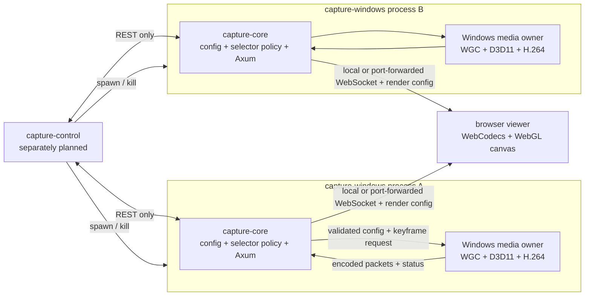

# TurboCapture M0 Migration Plan

**Status:** Active and authoritative  
**Principles:** [`M0-Principles.md`](M0-Principles.md)  
**Replaces:** the pre-split `M5-Plan.md`, which mixed LiveUI and speculative TurboCapture designs

## 1. Objective

M0 turns the forked combined LiveUI repository into a focused TurboCapture repository that can:

1. Select a Windows capture target using pure, deterministic policy.
2. Capture, crop/resample, and H.264-encode that target inside one `capture-windows` process.
3. Serve instance status, configuration, render configuration, and opaque video directly from that process.
4. Decode the video and perform transparency-producing post-processing in a browser canvas.
5. Run several independent streams by starting several independent processes.

M0 begins TurboCapture's own milestone sequence. It is not “LiveUI M5,” and it does not complete or preserve the LiveUI side of the former split plan.

The migration is complete when the CLI-launched capture path and browser viewer work on the current livestreaming machine without any active dependency on the old LiveUI orchestration, relay, shared-texture, presentation, audio, or metrics components. `capture-control` may be designed and implemented afterward.

## 2. Decisions Already Made

The following are fixed inputs to this plan rather than open design questions:

| Area | M0 decision |
| --- | --- |
| Product scope | Personal livestream utility; public use is intentionally unsupported |
| Target | Exactly the current Windows machine, GPU, encoder, drivers, and browser |
| Delivery | Run from source; no packaging or distribution work |
| Deployment | Viewer and capture endpoint are both localhost from the browser's perspective; remote capture is port-forwarded onto the viewing machine |
| Security | No authentication or TLS on the loopback/port-forwarded viewer path |
| Compatibility | No bridge or backward compatibility with the combined LiveUI runtime |
| Stream ownership | One `capture-windows` process owns one stream and one active capture session |
| Lifecycle | Process start creates a stream; process exit or kill stops it |
| Native video | Opaque frames only; no encoded alpha or side-by-side color/alpha |
| Transparency | Color keying and other transparency-producing work remain in WebGL/canvas |
| Native API | `capture-core` supplies the platform-independent Axum implementation |
| Control boundary | `capture-control` spawns/kills `capture-windows` and uses REST only |
| Recovery | Expected target changes recover in-process; foundational media failures exit the process |
| Operations | Explicit instance addresses and ports; no discovery or auto-restart in M0 |

## 3. Target Architecture



There is no central server in the video path. A browser connects to the particular instance it wants to display through a localhost port; an instance on another machine is first port-forwarded onto that loopback interface. Multiple instances are identical except for their startup configuration, listen address, and selected target policy.

## 4. Repository Shape and Dependency Direction

The intended active source tree is:

```text
TurboCapture/
├── capture-core/       # platform-independent Rust library
├── capture-windows/    # Windows Rust binary
├── capture-control/    # controlling binary; detailed plan deferred
├── frontend/           # minimal browser canvas viewer
└── docs/
```

The required Rust dependency direction is:

```text
capture-windows -> capture-core
capture-control -REST-> running capture-windows instances
```

`capture-core` must not depend on `capture-windows`. `capture-control` must not call media internals or obtain D3D resources. Sharing a narrowly scoped HTTP data-transfer type is acceptable if it reduces duplication, but the control surface must not acquire an in-process control path merely because both crates share a workspace.

### 4.1 `capture-core` ownership

`capture-core` is a library with cohesive modules rather than a generic framework. It owns:

- Configuration types and validation.
- Observed-window fact types that contain no Win32 handles or Windows API objects.
- Pure selector ranking, filtering, stickiness, and deterministic tie-breaking.
- Status and error representations exposed by one instance.
- Private video packet and codec-configuration types needed by Rust and the viewer protocol.
- Browser render-configuration data.
- Video subscriber fan-out and decoder-start synchronization.
- The Axum router, REST handlers, and video WebSocket handler.
- The single Clap argument model consumed by `capture-windows`.
- Narrow channel-facing interfaces through which a platform host supplies media status and encoded packets.

It does not own:

- Win32 enumeration or HWND lifetime.
- COM, WGC, DXGI, D3D11, Media Foundation, or hardware encoder objects.
- Process discovery, spawning, killing, or restarting.
- Static frontend hosting.
- LiveUI presentation features.

Configuration and selector code should expose concrete types and functions first. Traits, dynamic dispatch, and type-state APIs should appear only where an actual second implementation or compile-time invariant justifies their cost.

### 4.2 `capture-windows` ownership

`capture-windows` is a thin process entry point around one Windows media owner. It owns:

- Startup validation of the exact adapter, encoder, OS, and required device features.
- Window enumeration and conversion into `capture-core` observation records.
- Selector polling and translation of a selected record into a capture target.
- WGC creation, closure handling, and target replacement.
- A single D3D11 device/context and all textures used for capture and encoding.
- Crop, resample, reuse/clear behavior, BGRA-to-NV12 conversion, and fixed output geometry.
- A single Media Foundation H.264 encoder and keyframe requests.
- Construction of the `capture-core` service state and hosting its Axum router.
- Fatal process-level diagnostics and exit status.

Native frames remain in the process and on the GPU until the encoder produces a coded access unit. The implementation must not recreate the old shared cross-process texture, keyed mutex, stdout frame protocol, or relay chain.

### 4.3 `capture-control` boundary

The M0 migration establishes only these constraints:

- It launches independent `capture-windows` processes with explicit startup arguments.
- It kills a child to stop its stream.
- It reads status and replaces live configuration through REST.
- It knows no graphics API details and does not consume the video WebSocket.

Its UI toolkit, persistent configuration model, instance registry, preview, restart policy, and implementation phases are intentionally omitted. None are acceptance criteria for the capture pipeline in this document.

## 5. Runtime and Threading Model

Each `capture-windows` process contains two ownership domains.

### 5.1 Async service domain

The process main thread runs Tokio and Axum. This domain owns:

- TCP listening, HTTP requests, WebSocket connections, and viewer counts.
- The active validated configuration snapshot exposed through REST.
- Status snapshots received from the media owner.
- Codec configuration and render-configuration snapshots.
- Encoded-packet fan-out to viewers.
- Viewer lag detection and reconnect behavior.
- Observation of the media thread's terminal result.

No COM, D3D11, WGC, or Media Foundation object crosses into an async task.

### 5.2 Native media domain

One dedicated OS thread initializes COM as required and owns the native media state. Keeping device objects together makes thread affinity and unsafe invariants reviewable. This domain performs the recurring work:

1. Observe the newest validated configuration generation.
2. Poll current window facts and run the pure selector.
3. Keep the current WGC target, switch it, or wait when no eligible target exists.
4. Acquire the newest available captured frame.
5. Apply crop, fixed-output resampling, and any opaque native transforms.
6. Convert to NV12 and satisfy encoder input requests.
7. Drain encoder output and send owned codec/access-unit data to the async domain.
8. Publish a small status snapshot.

The precise WGC callback mechanism must respect the behavior of the selected free-threaded frame pool. The implementation may use a callback only to wake or enqueue work, but resource mutation and session transitions must have one documented owner. No UI event loop or hidden presentation window remains in the headless process.

### 5.3 Bounded communication

The domains communicate through small, bounded channels:

- **Configuration:** a latest-value channel carries only fully validated configuration snapshots. Superseded configurations need not queue.
- **Media commands:** a bounded channel carries rare commands such as “force the next decodable keyframe.” It does not carry ordinary frame work.
- **Status:** a latest-value channel publishes current target, capture state, frame counters/rates, and the latest diagnostic.
- **Encoded output:** a bounded channel carries owned codec data and H.264 access units from the media thread to the async service.
- **Termination:** a one-shot result reports clean or fatal media-thread completion to the process entry point.

The encoded-output channel must never grow without bound. The initial simple policy is to apply backpressure at this internal boundary; WGC should still consume the newest available frame after a stall so latency does not accumulate indefinitely. Slow WebSocket viewers never backpressure the media thread: a viewer that falls behind is disconnected and reconnects from a fresh keyframe.

### 5.4 Stream and target lifecycles

The process has no internal `Stopped` state. Its externally meaningful states are intentionally small:

| State | Meaning | Expected transition |
| --- | --- | --- |
| `waiting` | No eligible target currently exists | Selector finds an eligible target |
| `capturing` | WGC and encoder are producing the configured stream | Target changes, closes, or a fatal error occurs |
| `switching` | The old WGC session is closing and a selected replacement is opening | Returns to `capturing` or `waiting` |
| process exited | Stream does not exist | A controlling process may start a new instance |

These names describe status, not a generalized state-machine framework. Target closure and policy-driven switching are normal. Device removal, encoder corruption, or a violated startup invariant may end the process rather than attempting elaborate in-process reconstruction.

## 6. Configuration Contract

### 6.1 Startup configuration

The `capture-core` Clap definition should cover at least:

- Path to an initial configuration file.
- Listen address and port.
- Required adapter/device identity when it is not a fixed documented constant.
- Logging verbosity or equivalent diagnostics switch.

The process loads and validates its initial configuration before exposing a usable service. Listen address, port, adapter selection, and other resource-construction settings require process restart to change.

### 6.2 Live replacement

The REST surface uses complete replacement semantics:

- `GET` returns the active configuration and its generation.
- `PUT` accepts one complete candidate.
- `capture-core` parses and validates the complete candidate.
- A valid candidate atomically becomes the next generation.
- An invalid candidate returns a structured client error and does not mutate the active generation.

Policy rules and browser render parameters are expected to update live. A change requiring device, output media type, listener, or encoder reconstruction may be rejected as restart-required in M0 rather than hidden behind a complicated live transition.

### 6.3 Selection inputs and purity

Windows observation produces plain facts such as stable observation identity, process name, executable path where available, title, visibility, foreground status, bounds, and other policy inputs actually used by current rules. The pure selector consumes a fact snapshot plus validated policy and returns a decision; it performs no enumeration or Win32 calls.

Tests must cover:

- Allow and deny behavior.
- Deterministic priority and tie-breaking.
- Stickiness to a still-valid current target.
- Foreground preference where configured.
- Target disappearance and empty snapshots.
- Invalid or contradictory rule sets.

## 7. Private Instance API and Video Contract

Exact route spelling may be finalized during Phase 1, but the surface has four responsibilities and no more:

1. Read the current status.
2. Read and replace the live configuration.
3. Provide any read-only initialization data useful to the viewer.
4. Upgrade a viewer connection to the video WebSocket.

The service is private and may change in lockstep with `capture-control` and the frontend. It should use ordinary HTTP status codes and structured JSON errors. No authentication handshake or stable public compatibility layer is required.

### 7.1 Status

Status should be diagnostic rather than orchestration-heavy. It should include only values proven useful to the operator, such as:

- Configuration generation.
- `waiting`, `switching`, or `capturing` state.
- Selected target summary without exposing a raw HWND as a durable identity.
- Output dimensions and configured frame rate.
- Capture/encode rate and viewer count.
- Latest recoverable diagnostic, if any.

Fatal failures are ultimately communicated by process exit and stderr. The control surface does not need a second failure protocol for a process that no longer exists.

### 7.2 Video framing

M0 keeps the useful existing WebCodecs path:

- H.264 is transported as AVCC access units with an explicit keyframe flag and timestamp.
- Decoder configuration carries output dimensions, SPS, and PPS or an equivalent `avcC` description.
- Browser render configuration is sent as a distinct JSON message on the same viewer connection.
- Encoded pictures are opaque. No alpha plane, packed alpha region, or second synchronized stream exists.

On viewer connection or decoder discontinuity, the server requests a fresh IDR from the media owner and does not forward dependent pictures to that viewer until the IDR arrives. This is simpler and more correct than sending one cached old keyframe followed by frames that may depend on omitted references. The personal-use viewer count makes the extra keyframe acceptable.

A codec reinitialization sends new decoder configuration before the first keyframe of the new generation. A render-only configuration change sends a new render-configuration message without restarting the decoder.

### 7.3 Network behavior

- The native listener address is explicit and can remain loopback-only on its host.
- The browser accepts only a capture port and always connects to `ws://127.0.0.1:<port>/api/video`.
- A capture instance on another machine is exposed through operator-managed local port forwarding rather than direct browser LAN access.
- Cross-origin access between the two localhost ports is allowed for the configured trusted workflow.
- Viewer disconnect is ordinary and does not alter capture.
- A lagging viewer is disconnected instead of creating unbounded buffers or blocking capture.
- The viewer reconnects with a small bounded delay and starts again from fresh initialization plus an IDR.
- There is no instance discovery, central relay, or stream registry in M0.

## 8. Browser Viewer Boundary

The frontend is a small independently hosted viewer, not a control surface. It:

- Receives a capture port through the exact `#/canvas?port=<port>` client-side route.
- Derives the fixed `ws://127.0.0.1:<port>/api/video` endpoint without accepting an arbitrary host or protocol.
- Connects to that instance's private video WebSocket.
- Configures WebCodecs from the received codec data.
- Uploads decoded opaque frames to WebGL.
- Applies the existing browser-side color-key/transparency pipeline using received render configuration.
- Draws only the resulting canvas and produces no visible error chrome in livestream output.
- Logs diagnostics for development and reconnects after instance or network interruption.

The migration should reuse the current AVCC/WebCodecs and `frontend/src/video/color-key.ts` knowledge where it remains correct. It should remove widgets, audio, KPM, strings, tokens, webview assumptions, and other LiveUI presentation code rather than preserving a general frontend shell.

An embedded native preview is not part of M0. Opening the viewer in a browser is the preview and validation path.

## 9. Phased Migration

Each phase ends with a usable, reviewable boundary. Target crates should build and their relevant tests should pass at phase completion; superseded LiveUI binaries are not required to keep working.

### Phase 0 — Establish TurboCapture authority and identity

**Purpose:** Make the fork unambiguously TurboCapture before moving implementation.

Work:

1. Adopt this document and `M0-Principles.md` as the authoritative M0 documentation.
2. Remove the former combined `M5-Plan.md`; history remains available through jj.
3. Correct repository name, description, remote, default bookmark/launcher assumptions, and top-level documentation that still identify the project as Nekomaru-LiveUI.
4. Record the common pre-split revision in the rewritten repository overview for provenance, without retaining a live cross-repository dependency.
5. State plainly that the stable pre-split LiveUI branch remains the operational livestream fallback during M0.

Exit gate:

- A contributor entering the repository sees TurboCapture naming, principles, and this plan first.
- No second active document claims to define the TurboCapture migration.
- Repository operations target the TurboCapture remote/bookmark intentionally.

### Phase 1 — Create the platform-independent `capture-core`

**Purpose:** Establish the seam that makes Windows media code a host of a testable policy and API library.

Work:

1. Create the `capture-core` library and organize it around configuration, selector policy, API types/state, video messages, and CLI definitions.
2. Move and simplify the pure selector rules from `live-capture`; translate runtime observations at the boundary instead of admitting Win32 types into the library.
3. Consolidate only the useful private video framing and AVCC helpers from `live-protocol`.
4. Move the reusable video cache/fan-out ideas from `live-server`, correcting late-viewer startup to wait for a fresh IDR.
5. Implement the Axum router against platform-neutral state and channel endpoints supplied by a future host.
6. Define full-replacement configuration validation and last-valid retention.
7. Define the Clap arguments once in the library.
8. Add unit tests for selector decisions, validation failures, configuration generation, API error responses, video message parsing, and late-viewer gating.

Failure rules:

- Library functions return typed errors for validation and protocol failures.
- Axum translates expected client errors into structured responses.
- There are no panics for malformed HTTP, configuration, or video inputs.

Exit gate:

- `capture-core` has no Windows dependency or Windows type in its public surface.
- Selector and router tests run without a desktop, WGC, D3D device, or hardware encoder.
- A small test host can publish fake status/video and exercise the complete viewer/API behavior.

### Phase 2 — Build one-process Windows capture and encode

**Purpose:** Replace the old capture-worker/shared-texture/encoder-worker topology with one clear native owner.

Work:

1. Create the `capture-windows` binary using the Clap definition from `capture-core`.
2. Validate the exact target adapter, D3D11 features, WGC availability, and Media Foundation H.264 encoder at startup.
3. Move Windows observation from `live-capture` and feed plain fact snapshots into the pure selector.
4. Move WGC session creation and target switching into the dedicated media thread; remove the hidden winit window and presentation path.
5. Move crop, fixed-output resampling, reuse/clear semantics, and BGRA-to-NV12 conversion into the same device owner.
6. Move the Media Foundation encoder into that owner and feed it directly from in-process GPU resources.
7. Replace stdout framing with bounded in-process delivery of codec configuration and encoded access units to `capture-core` state.
8. Implement forced-IDR requests used by new or recovering viewers.
9. Report waiting/capturing/switching status and terminal media errors through the defined channels.

Hot-path rules:

- No cross-process texture or keyed mutex remains.
- No GPU readback is introduced before encoder submission unless the actual API forces it and the reason is documented.
- Captured frames do not accumulate; after a stall, resume from the newest useful frame.
- Fixed output media types should survive ordinary target switches.
- Performance changes are measured in release builds on the target machine.

Exit gate:

- One process can wait for a target, capture it, switch targets by policy, and produce decodable H.264.
- Closing the target returns the instance to selection rather than terminating it.
- A device/encoder invariant failure produces one useful diagnostic and a non-zero exit.
- No `live-stream`, `live-capture-shared`, `live-encoder`, or `live-ws` runtime path is involved.

### Phase 3 — Serve the capture instance directly

**Purpose:** Make each native process a complete one-stream service.

Work:

1. Construct `capture-core` API state around the media thread's bounded channels.
2. Bind the configured listener and serve the platform-independent Axum router from `capture-windows`.
3. Expose status and full configuration replacement over REST.
4. Stream render configuration, decoder configuration, timestamps, keyframe flags, and AVCC access units over the viewer WebSocket.
5. Implement viewer counting, fresh-IDR startup, lag disconnect, and bounded reconnect behavior.
6. Allow the required trusted cross-origin viewer access.
7. Verify two instances can bind distinct ports, select different policies, and fail independently.

Exit gate:

- A test client can configure and inspect each instance using REST only.
- A WebCodecs test client can connect late, receive a fresh IDR, and decode without relying on omitted reference frames.
- A slow or disconnected client neither blocks capture nor grows memory without bound.
- Killing one instance removes exactly one stream and does not affect another.

### Phase 4 — Reduce the frontend to the canvas viewer

**Purpose:** Complete native-to-web-canvas streaming while preserving the correct transparency boundary.

Work:

1. Reduce the existing frontend to endpoint configuration, private video transport, WebCodecs decode, and WebGL canvas rendering.
2. Retain and verify the existing browser color-key logic instead of moving it into the native encoder.
3. Apply render-configuration changes independently of decoder configuration.
4. Remove audio, KPM, strings, widgets, tokens, marquees, Svelte control UI, and webview-specific integration.
5. Provide a neutral/transparent visual state while waiting or reconnecting; keep diagnostics in developer logging.
6. Verify same-machine and port-forwarded LiveUI/OBS embedding paths using explicit localhost ports.

Visual gate on the actual livestreaming setup:

- The decoded opaque image matches the native capture geometry and color closely enough for the current stream.
- Keyed edges, spill treatment, and alpha stability match or improve the current browser pipeline.
- Target switching and reconnect do not leave stale frames or visible error surfaces.
- End-to-end latency and frame pacing are acceptable in a release build.

Exit gate:

- The viewer is useful without LiveUI and has no control-surface responsibilities.
- LiveUI can treat the viewer as an opaque iframe/canvas source.
- No alpha information is carried by the native video stream.

### Phase 5 — Remove the combined-repository architecture

**Purpose:** Leave a small TurboCapture codebase instead of a new path beside an abandoned system.

Work:

1. Remove migrated or irrelevant crates: `live-app`, `live-audio`, `live-capture`, `live-capture-shared`, `live-encoder`, `live-kpm`, `live-protocol`, `live-server`, `live-stream`, and `live-ws`.
2. Absorb or remove `enumerate-windows` and `set-dpi-awareness` according to the new Windows ownership boundary; do not retain tiny binaries without an actual standalone use.
3. Remove LiveUI-only frontend assets, Nushell launchers, shader entries, dependencies, environment variables, and documentation.
4. Rewrite `docs/README.md` for the final M0 architecture and operating workflow.
5. Reduce `.justfile` and supporting scripts to source-build, launch, test, frontend-check, and repository operations actually used by TurboCapture.
6. Add a minimal placeholder `capture-control` crate only if needed to reserve workspace naming; do not invent its design in this migration.
7. Run release-mode Rust checks/tests and the existing Bun TypeScript/Svelte checks that remain relevant.
8. Perform a complete livestream rehearsal from a clean process state.

Exit gate:

- The active workspace contains the target crates and no old runtime topology.
- The repository builds, tests, launches, and documents TurboCapture without Nekomaru-LiveUI services or files.
- Removed implementation remains recoverable through jj history rather than active archive directories.
- The operational fallback remains the stable pre-split LiveUI branch, not compatibility code inside TurboCapture.

## 10. Verification Matrix

The following scenarios define M0 behavior on the target machine:

| Scenario | Expected result |
| --- | --- |
| Initial configuration is invalid | Process exits before serving a misleadingly usable instance |
| Config `PUT` is invalid | Structured error; previous generation remains active |
| No policy target exists | Process remains alive in `waiting` |
| Eligible target appears | Instance begins capture without restart |
| Current target closes | Session closes; selector waits or switches |
| Policy selects a different target | WGC session changes while output stream identity remains the process endpoint |
| Viewer connects late | Server forces a new IDR; decode begins at a valid boundary |
| Viewer cannot keep up | Only that viewer disconnects; capture continues |
| Viewer reconnects | It receives current render/codec configuration and a fresh IDR |
| Render parameters change | Canvas processing changes without decoder restart |
| Unsupported adapter/encoder is observed | Startup fails with the exact violated invariant |
| D3D or encoder fails unrecoverably | Instance exits non-zero; no elaborate internal recovery |
| Two instances run | Each uses its own port, session, encoder, status, and failure boundary |
| One instance is killed | Its stream stops; the other instance is unaffected |
| Viewer uses a remote capture host | Port-forwarded capture port works through the same localhost iframe route without TLS |

## 11. M0 Completion Criteria

M0 is complete when all of the following are true:

- `capture-core` contains shared types, validated configuration, pure selector logic, the private instance API, video fan-out, and the shared Clap definition without Windows dependencies.
- `capture-windows` owns one target/session/stream process and directly connects WGC/D3D11 processing to Media Foundation encoding.
- The native process serves its own REST and video interfaces without a relay, stdout media pipe, or shared cross-process texture.
- A separately hosted browser viewer decodes opaque H.264 and performs transparency-producing processing in its canvas.
- Multiple streams are created by running multiple instances on explicit ports.
- Expected target loss is recoverable; foundational machine/media failures are clear fatal exits.
- Configuration replacement is atomic and preserves the last valid generation on rejection.
- The old LiveUI runtime crates and presentation responsibilities are absent from the active TurboCapture workspace.
- Current documentation describes TurboCapture M0, not the combined repository.
- The complete workflow has been rehearsed in release builds on the actual livestreaming machine and over the intended viewer path.

`capture-control` is not required for this completion gate. The CLI, REST API, browser viewer, and ordinary process tools are sufficient to validate M0.

## 12. Deferred Decisions

The following are intentionally deferred because they do not block the M0 capture path:

### `capture-control`

- UI toolkit and layout.
- Instance configuration persistence.
- Port allocation and instance naming UX.
- Child output presentation and history.
- Manual versus automatic restart policy.
- Whether it opens browser previews or embeds any preview at all.

### Post-M0 product work

- Packaging, installation, and public documentation.
- Authentication or browser access outside the trusted loopback/port-forwarded path.
- Other operating systems, GPUs, encoders, or browser fallbacks.
- Stable external API/version compatibility.
- Audio or other LiveUI-adjacent signals.
- Native transparency or alternate video codecs.
- Generalized profiling, telemetry, and automated recovery.

Exact private JSON field names and route spelling may be chosen during Phase 1, but their responsibilities and ownership boundaries are fixed by this plan. A choice that changes the three-crate split, process-per-stream model, opaque-video boundary, or browser-owned transparency requires an explicit revision to this document and `M0-Principles.md`.
