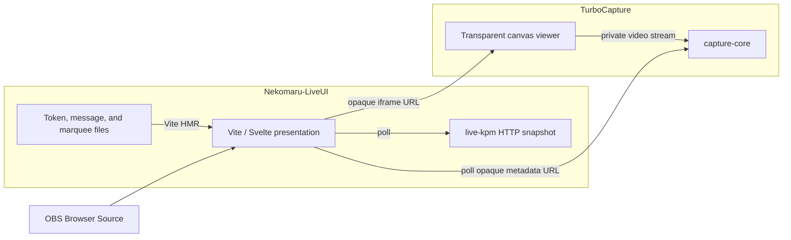

# Nekomaru-LiveUI / TurboCapture — M5 Repository Split Plan

**Date**: 2026-08-14  
**Authors**: Nekomaru + Codex  
**Status**: Agreed architecture and migration plan. Detailed design inside each product remains follow-up work.

---

## Purpose

M5 separates the current repository into two independently useful products:

- **TurboCapture** owns capture, native GPU post-processing, encoding, transport, and a transparent web-canvas viewer.
- **Nekomaru-LiveUI** owns the personal livestream presentation, local measurements, and runtime content used by OBS Browser Source.

The split is made by duplicating the complete repository history at a final M4 revision and then evolving the two repositories independently. History, rather than dormant source trees or shared compatibility packages, preserves the relationship between the products.

This document decides the repository boundary and the interaction surface between the resulting products. It intentionally does not freeze every internal API, configuration field, command-line option, or UI workflow. Those details belong in follow-up plans inside the respective repositories.

## Why Split

The M4 architecture treats capture, aggregation, presentation, and several experiments as parts of one system. That no longer reflects how the project is operated:

- OBS Browser Source is the actual presentation host, so `live-app` duplicates a role that is already handled better elsewhere.
- `live-server` primarily forwards or aggregates information rather than owning domain logic. Its consumers can fetch authoritative sources directly.
- Network audio has not been actively used for months and is too fragile to justify its complexity.
- Capture and encoding form a coherent reusable product with different performance, configuration, and lifecycle requirements from the livestream presentation.
- Binary video transport is fundamentally different from low-frequency status such as keypress rate or token usage. A shared protocol layer gives them compatibility obligations without a shared product need.

M5 therefore replaces a shared-infrastructure architecture with two products joined by a deliberately small public boundary.

## Decisions

1. The repository is duplicated with full VCS history into `Nekomaru-LiveUI` and `TurboCapture`.
2. The repositories have no source, path, package, workspace, submodule, or Git dependency on each other.
3. LiveUI embeds TurboCapture through one complete, opaque viewer URL.
4. LiveUI reads TurboCapture state through one complete, opaque, versioned metadata URL.
5. LiveUI does not construct TurboCapture routes, parse its video protocol, inspect its iframe DOM, or exchange `postMessage` events with it.
6. Cross-product state transfer is pull-only. TurboCapture does not initiate application messages or callbacks into LiveUI.
7. TurboCapture owns all capture configuration and image processing, including crop, resampling, color grading, color keying, matte generation, and related post-processing.
8. Configurable image processing runs in TurboCapture's native DirectX pipeline. Browser GPU code only reconstructs the transported image for display.
9. Nekomaru-LiveUI intentionally uses the Vite development server during real livestreaming sessions. M5 does not introduce a production server or production mode.
10. Removed components are deleted from the active trees after the split. The shared history is their archive.

## Non-Goals

M5 does not attempt to:

- Preserve compatibility between the two repositories' internal wire formats.
- Create a separately versioned shared protocol or utility repository.
- Turn LiveUI into a general-purpose streaming platform.
- Turn TurboCapture's viewer into a configuration or monitoring dashboard.
- Add a production web server for LiveUI.
- Restore or redesign network audio.
- Decide every TurboCapture configuration field, CLI flag, REST route, or GUI interaction.
- Decide the final representation of every LiveUI runtime content file.
- Add authentication for a trusted personal deployment. If either product is exposed beyond that environment, security must be designed separately.

## Product Boundary



The diagram contains the complete cross-product relationship: an iframe document and a read-only metadata resource. The video stream remains internal to TurboCapture even when the stream crosses machines or origins.

### LiveUI Configuration

LiveUI stores complete URLs rather than a base URL from which it constructs TurboCapture routes. A conceptual configuration is:

```json
{
  "capture": {
    "iframeUrl": "http://capture-viewer:5174/?core=http%3A%2F%2Fcapture-host%3A8080",
    "metadataUrl": "http://capture-host:8080/api/v1/status"
  }
}
```

The route names in this example are illustrative, not a frozen API. The important contract is that both values are complete URLs owned by TurboCapture deployment configuration.

This opacity allows TurboCapture to change:

- Whether the viewer and core share an origin.
- Its route structure.
- How the viewer receives its core endpoint.
- Whether one core manages one or several capture sessions.
- Whether static viewer files are hosted by Vite, `bunx --bun` tooling, or another static server.

None of those changes should require LiveUI source changes.

### Viewer Contract

The iframe URL identifies a document that:

- Connects directly to its configured `capture-core` endpoint.
- Renders the decoded output into a transparent canvas.
- Contains no visible controls, status panels, debug text, branding, or error overlays.
- Fails visually transparent when capture is unavailable or the decoder is recovering.
- Does not require or emit `postMessage` events.
- Does not assume that its static origin, the core origin, and the LiveUI origin are equal.

LiveUI treats the iframe as an opaque visual source. It may show or hide the iframe based on its own presentation policy and metadata polling, but it must not depend on the iframe's internal DOM or JavaScript state.

### Metadata Contract

The metadata URL identifies a side-effect-free, read-only HTTP resource. Its representation is versioned and is expected to expose concepts such as:

- Schema version.
- Capture generation or another monotonically changing identity for discontinuities.
- Current lifecycle state.
- Active profile and human-readable label, when available.
- Output dimensions and nominal frame rate, when available.

The exact JSON field names and lifecycle enum belong to the TurboCapture design. Before integration, the schema must specify:

- Which fields are required and which are optional.
- How an idle, switching, recovering, or failed capture is represented.
- Whether unknown fields and states must be ignored by older consumers.
- Cache behavior and a suitable polling interval.

Polling must be safe under HTTP keep-alive and must not mutate capture state. An unreachable endpoint, unsupported schema, or malformed response degrades only the capture-dependent parts of LiveUI; it must not stop the rest of the presentation.

Because cross-origin use is intentional, TurboCapture must support the required REST CORS policy. Its viewer-to-core connection must likewise work across the origins supported by the deployment. Exact allow-list configuration is a TurboCapture concern.

### Explicitly Excluded Coupling

The following are not part of the product boundary:

- TurboCapture's encoded-frame header or binary frame layout.
- Decoder configuration and keyframe cache behavior.
- TurboCapture configuration types.
- Direct control of TurboCapture from LiveUI.
- Shared Rust crates or TypeScript packages.
- A central LiveUI server that relays TurboCapture data.
- Browser `postMessage` coordination.

If a future feature appears to require one of these, it must first demonstrate why the two-URL contract is insufficient. Convenience alone is not enough reason to recreate shared infrastructure.

## Future Nekomaru-LiveUI

### Responsibility

Nekomaru-LiveUI is the livestream presentation product. It composes visual elements for OBS and reads low-frequency state from independent sources. It does not capture, process, encode, relay, or decode video itself.

### Repository Shape

The current frontend is flattened to the repository root so Vite becomes the application entry point:

```text
Nekomaru-LiveUI/
├── index.html
├── package.json
├── vite.config.*
├── src/
├── live-kpm/
├── scripts/
└── docs/
```

This is a conceptual shape rather than a commitment to exact directory names. The important outcome is that a wrapper server or nested frontend workspace is not required to start LiveUI.

### Runtime Model

- Vite is the real operating server as well as the development server.
- OBS Browser Source loads the Vite application directly.
- The frontend polls `live-kpm` and TurboCapture metadata independently.
- TurboCapture visuals are composed through the configured iframe URL.
- Token usage, message, and marquee producers may write complete files imported by the Vite application; HMR delivers the updates.

Generated runtime files must not create noisy VCS changes. They should be ignored where appropriate and have stable fallback values so a fresh checkout still starts. Writers must replace data in a way that never exposes a partially written or syntactically invalid file to Vite. A Nushell workflow is the initial design; a dedicated `live-tokens` binary remains an option only if the file/HMR approach proves unreliable or awkward.

### `live-kpm`

`live-kpm` remains a separate native binary because the keyboard hook is its own domain and failure boundary. In M5 it becomes a small HTTP server exposing a current snapshot for polling rather than emitting a WebSocket or shared binary protocol.

Its detailed route and response schema are deferred, but the service must:

- Own keypress observation and rate calculation.
- Return a read-only current snapshot.
- Tolerate repeated requests over a reused TCP connection.
- Remain useful and testable without the LiveUI frontend.
- Allow LiveUI to continue running when the service is absent.

The low update frequency makes REST semantics and operational simplicity more valuable than avoiding the small polling overhead.

### Removed Responsibilities

- **`live-app`**: removed. OBS Browser Source replaces the custom webview host. No M5 replacement for YouTube Music handling is required by this split.
- **`live-server`**: removed. Authoritative sources are fetched directly rather than re-exposed through an aggregation process.
- **`live-audio`**: removed and retained only in history.
- **`live-protocol` and `live-ws`**: removed. LiveUI no longer consumes a shared binary stream.
- **Capture and encoding crates**: removed after TurboCapture is established from the common history.

### LiveUI Failure Policy

- Missing KPM data leaves the relevant display unavailable or at a neutral fallback; it does not block rendering.
- Missing token, message, or marquee files use defined initial values.
- Invalid generated files retain the last valid state when practical and are diagnosed without adding visible OBS output.
- Missing or incompatible TurboCapture metadata hides or neutralizes capture-dependent presentation.
- Operational diagnostics belong in developer logging, not in the composed livestream canvas.

## Future TurboCapture

### Responsibility

TurboCapture is an independent capture product. Given a capture configuration, it produces processed frames, encodes them, exposes capture metadata, and provides a minimal web viewer that renders the result to a canvas.

TurboCapture must remain useful without Nekomaru-LiveUI. Its CLI, native control application, and viewer are separate ways to operate or consume the same core.

### Repository Shape

```text
TurboCapture/
├── capture-config/
├── capture-core/
├── capture-app/
├── frontend/
└── docs/
```

The exact Cargo workspace and package layout is a TurboCapture follow-up decision.

### `capture-config`

`capture-config` is a pure types, validation, and policy library. It owns:

- The versioned configuration surface.
- Capture target and output configuration.
- Crop and resampling parameters.
- Color grading, color keying, matte, and other post-processing parameters.
- Auto-selector rules and deterministic selection policy.
- Validation and compatibility rules for persisted configurations.

It does not own window enumeration, Win32 calls, GPU resources, network services, or other runtime observations. `capture-core` gathers runtime facts and supplies them to pure selection logic. This keeps configuration and selection behavior testable without a desktop or GPU.

Invalid configuration must be rejected before mutating a running pipeline. When live editing is supported, the last valid configuration remains active until a complete replacement has passed validation.

### `capture-core`

`capture-core` is the runtime library with a thin CLI entry point. It combines the current capture, encoding, and video-serving responsibilities in one process and owns:

- Window discovery and capture-session lifecycle.
- Auto-selector observation and target switching.
- DirectX device and resource management.
- One native GPU post-processing pipeline.
- H.264 encoding and codec-state management.
- The private viewer video API or WebSocket.
- The versioned metadata resource.
- Keyframe and decoder-configuration caching needed by late or reconnecting viewers.
- Recovery from target loss, capture failure, encoder failure, and device loss.

Combining these responsibilities removes cross-process texture sharing, keyed-mutex synchronization, standard-I/O framing, and a separate `live-ws` relay from the hot path. Frames should stay on the GPU through processing and encoder submission unless a platform constraint proves a readback necessary.

The CLI supports simple configurations and headless operation. Detailed CLI syntax and whether more advanced configuration is file-based are deferred.

`capture-core` is not required to serve static viewer assets. The frontend may be served by Vite or any suitable static file server and pointed at any reachable core endpoint. Optional convenience hosting may be considered later, but it must not become an assumption of the viewer or the LiveUI contract.

### `capture-app`

`capture-app` is a native control and configuration application:

- UI is implemented with egui.
- Preview uses a native DirectX 11 viewport.
- Configuration editing uses `capture-config` types and validation.
- Runtime control is built on `capture-core` rather than a second capture implementation.

It is not a webview host and is never intended for direct composition into OBS. Control surfaces, status details, validation errors, and diagnostics belong here rather than in the transparent web viewer.

### Viewer Frontend

The TurboCapture frontend is a small Vite-driven viewer that:

- Accepts or derives a complete `capture-core` endpoint independently of its own origin.
- Receives TurboCapture's private video transport.
- Decodes frames using the chosen browser decoder path.
- Performs only fixed transport reconstruction needed to produce RGBA.
- Draws a transparent canvas without a visible control surface.

The viewer's transport and binary format can evolve with TurboCapture. They are not public compatibility obligations for LiveUI.

## Native Processing and Transparency Direction

Post-processing belongs entirely to TurboCapture. The initial pipeline direction is:

```text
capture
  → crop / resample
  → color grading / keying / matte generation / unspill
  → pack color and alpha into one coded picture
  → BGRA-to-NV12 conversion
  → H.264 encode
  → private viewer transport
  → browser decode
  → fixed unpack shader
  → transparent canvas
```

The browser shader is transport reconstruction, not a second configurable post-processing pipeline.

### Side-by-Side Color and Alpha

The initial transparency transport packs color and grayscale alpha side by side into one H.264 picture. Both regions are produced from the same captured frame and configuration generation. They therefore share one encoded picture, timestamp, decoder callback, and loss/recovery behavior; temporal synchronization is guaranteed by construction rather than approximated across two decoders.

The baseline packed layout is conceptually:

```text
[ RGB W×H ][ replicated RGB guard ][ replicated alpha guard ][ alpha W×H ]
```

The initial guard-band target is 32 pixels on each side of the seam, 64 pixels total, with coded dimensions adjusted to satisfy NV12 and encoder alignment requirements. For a 1920-pixel output width, the conceptual coded width is `1920 + 32 + 32 + 1920 = 3904` pixels.

The guards reduce contamination from scaling filters, chroma subsampling, block transforms, deblocking, ringing, and motion prediction near the seam. They do not mathematically isolate the two regions under every encoder decision, so their size remains a validated default rather than a universal constant.

### Transparency Acceptance Gate

Before side-by-side transport becomes a stable TurboCapture format, it must be tested on the actual target browser, GPU, encoder, resolution, and livestream settings for:

- Hardware encoder and browser decoder support for the packed dimensions.
- Alpha edge quality on high-contrast and fine-detail content.
- Bleeding across the seam and through the guard bands.
- Alpha banding and stability under motion.
- Bitrate, latency, GPU cost, and decoder cost.
- Correct output after keyframe loss, reconnect, generation change, and device recovery.

If it cannot meet the visual or hardware requirements, a separately encoded alpha stream is the fallback. That fallback would require explicit timestamp pairing, queue bounds, discontinuity handling, and recovery rules and is therefore not the default design.

## Component Disposition

| M4 component or responsibility | Nekomaru-LiveUI | TurboCapture |
| --- | --- | --- |
| Existing presentation frontend | Flatten and retain as the product frontend | Reuse only relevant viewer knowledge, then develop an independent minimal viewer |
| OBS-facing composition | Own | Expose only a transparent iframe document |
| `live-kpm` | Retain as a polling HTTP service | Remove |
| Token usage detector | Retain; initially feed Vite-imported files | Remove |
| Message and marquee inputs | Retain; initially feed Vite-imported files | Remove |
| `live-app` | Remove | Remove |
| `live-audio` | Remove | Remove |
| `live-server` | Remove | Absorb only video metadata, stream serving, and recovery responsibilities into `capture-core` |
| `live-capture` | Remove after split | Consolidate into `capture-core` |
| `live-encoder` | Remove after split | Consolidate into `capture-core` |
| `live-ws` | Remove | Replace with private in-process transport code in `capture-core` and the viewer |
| `live-protocol` | Remove | Reuse ideas if useful, but keep any resulting format private to TurboCapture |
| Auto-selector policy | Remove | Move pure rules to `capture-config`; runtime observation remains in `capture-core` |
| Crop, resample, color, and key configuration | Remove | Own in `capture-config` and execute in the native `capture-core` pipeline |
| Web canvas video decoding | Treat as an opaque iframe | Own in the viewer frontend |

Removal occurs through ordinary commits after the histories are duplicated. The split must not rewrite the common past merely to make either repository appear as though it had always been independent.

## Migration Plan

### Phase 0 — Establish the Common M4 Endpoint

1. Finish or explicitly defer any remaining M4 work needed for a stable checkpoint.
2. Commit this M5 plan in the common repository.
3. Record an immutable source revision and, if useful, a human-readable M4-final tag.
4. Verify the existing application at that revision well enough to distinguish migration regressions from pre-existing behavior.

The recorded revision is the provenance point for both products and the recovery point if either migration needs to restart.

### Phase 1 — Duplicate the Histories

1. Create `Nekomaru-LiveUI` and `TurboCapture` repositories from the recorded revision, preserving the complete commit graph.
2. Configure their remotes and repository metadata independently.
3. Record the common source revision in both repositories.
4. Confirm that the histories agree through the split revision before making product-specific commits.

No source directory is copied between already-diverged repositories as a substitute for this history-preserving split.

### Phase 2 — Make Nekomaru-LiveUI Independent

1. Flatten the presentation frontend to the repository root.
2. Remove `live-app` and use OBS Browser Source as the only required host.
3. Convert `live-kpm` to a standalone polling HTTP service.
4. Move token, message, and marquee updates to the initial file/HMR path with safe fallbacks.
5. Configure the complete TurboCapture iframe and metadata URLs.
6. Remove `live-server`, video transport crates, capture/encoder crates, and archived audio code.
7. Verify that LiveUI starts and remains useful when TurboCapture or `live-kpm` is unavailable.

This phase is complete when LiveUI has no build-time or runtime dependency on the TurboCapture repository beyond optional network access to its two configured URLs.

### Phase 3 — Make TurboCapture Independent

1. Establish the `capture-config`, `capture-core`, and `capture-app` boundaries.
2. Consolidate capture, processing, encoding, and video serving into the `capture-core` process.
3. Move all post-processing configuration and selection policy into TurboCapture-owned APIs.
4. Build the independently hosted transparent viewer around a configurable core endpoint.
5. Expose the versioned read-only metadata resource.
6. Remove presentation widgets, `live-kpm`, token tooling, `live-app`, `live-audio`, and the aggregation server.
7. Validate side-by-side transparency on target hardware or select the documented fallback.

This phase is complete when TurboCapture can be configured, operated, previewed, and viewed without any Nekomaru-LiveUI files or services.

### Phase 4 — Validate the Boundary

1. Serve LiveUI, the TurboCapture viewer, and `capture-core` from deliberately different origins.
2. Configure LiveUI with only the complete iframe and metadata URLs.
3. Confirm that video flows directly between the viewer and core and never through LiveUI.
4. Confirm that metadata polling survives startup ordering, temporary unavailability, restarts, and schema rejection.
5. Confirm that neither repository references the other's filesystem, packages, source tree, or internal binary protocol.
6. Run an OBS rehearsal covering capture switching, decoder recovery, LiveUI HMR updates, and service failure fallbacks.

## Acceptance Criteria

### Repository Split

- Both repositories contain the complete history through the recorded M4 revision.
- Product-specific changes begin only after that revision.
- Neither repository depends on the other repository to build, test, or start.
- Removed M4 components remain discoverable through history rather than active archive directories.

### Nekomaru-LiveUI

- The root Vite application is the normal livestream runtime.
- OBS Browser Source can load the presentation without `live-app` or `live-server`.
- KPM is obtained by polling its standalone HTTP resource.
- Token, message, and marquee updates work through the chosen direct input path without partial-file failures.
- TurboCapture is configured using only an iframe URL and metadata URL.
- Missing optional services do not replace the livestream composition with visible error output.
- No LiveUI code imports or parses TurboCapture's private frame protocol.

### TurboCapture

- `capture-config` can validate configuration and exercise selection policy without Win32, GPU, or network access.
- Capture, native processing, encoding, and serving operate in one `capture-core` process without shared cross-process textures.
- The CLI can run a simple capture without `capture-app`.
- `capture-app` provides egui controls and a native DirectX 11 preview rather than a webview.
- The viewer works when hosted separately from `capture-core` and renders no visible control surface.
- The metadata resource is versioned, read-only, and safe to poll.
- Transparency passes the hardware acceptance gate or the fallback transport is explicitly selected and specified.

### Cross-Product Integration

- LiveUI embeds the viewer as an opaque iframe.
- LiveUI polls metadata; TurboCapture initiates no application messages into LiveUI.
- No `postMessage` contract exists.
- Static hosting and API/video endpoints may use different hosts and ports.
- TurboCapture post-processing behavior and configuration do not cross the product boundary.

## Risks and Mitigations

| Risk | Consequence | Mitigation |
| --- | --- | --- |
| Duplicated history initially leaves much irrelevant code in each repository | Confusing intermediate state | Make deletion and boundary-establishment commits immediately after the common split point |
| A shared package is introduced for convenience | Repositories stop evolving independently | Keep only the small HTTP/URL contract public and duplicate trivial consumer types when necessary |
| LiveUI starts constructing TurboCapture routes | Internal deployment changes break integration | Store complete opaque URLs |
| Cross-origin behavior is tested only on one machine | Integration fails when services move to different hosts or ports | Include a deliberately split-origin rehearsal in Phase 4 |
| Polling failures leak visible error UI into OBS | Livestream output exposes diagnostics | Use neutral/transparent visual fallbacks and developer-only logging |
| Vite reads runtime content during a partial write | HMR reports parse errors or temporarily invalid state | Use complete replacement writes and stable checked-in or generated fallbacks |
| Side-by-side alpha exceeds a hardware limit or compresses poorly | Transparency is unusable on the target path | Treat it as a hardware acceptance gate and retain dual-stream encoding as a designed fallback |
| One native process concentrates capture failures | Core outage affects capture, encoding, and serving together | Define explicit recovery states, retain last valid configuration, and exercise device-loss and reconnect paths |
| The plan over-specifies internal designs before either split settles | Early implementation discoveries cause unnecessary churn | Freeze the ownership boundary now and defer internal API details to each product |

## Deferred Per-Product Decisions

The following are intentionally not blockers for the split:

### Nekomaru-LiveUI

- Exact `live-kpm` route, snapshot schema, and polling interval.
- Exact runtime file names and formats for tokens, messages, and marquee content.
- Whether a future `live-tokens` binary is useful after experience with HMR-driven files.
- The future handling of YouTube Music presentation.

### TurboCapture

- Exact Cargo package layout and public Rust APIs.
- Complete configuration schema, migration policy, and persistence format.
- CLI command structure and advanced configuration workflow.
- Control flow between `capture-app` and a running `capture-core`.
- Exact metadata field names and lifecycle state machine.
- Private video framing and reconnect protocol.
- Final H.264 parameters, guard size, alpha reconstruction details, and bitrate policy.
- Whether optional convenience hosting of viewer assets is worth adding.

These decisions may change independently without reopening the repository boundary, provided the two-URL integration contract remains intact.

## Definition of Done

M5 is done when the original combined project has become two history-preserving repositories that can each be used alone:

- Nekomaru-LiveUI runs as a root-level Vite presentation for OBS, obtains low-frequency inputs directly, and treats capture as an optional opaque iframe plus polled metadata.
- TurboCapture captures, processes, encodes, previews, serves metadata, and renders a transparent canvas without relying on LiveUI.
- The products communicate only through the configured viewer and metadata URLs.
- All video format, decoder, and post-processing details remain private to TurboCapture.
- Removed experiments and infrastructure are absent from the active source trees but preserved in the shared history.

At that point, future milestones are planned separately in the two repositories.
