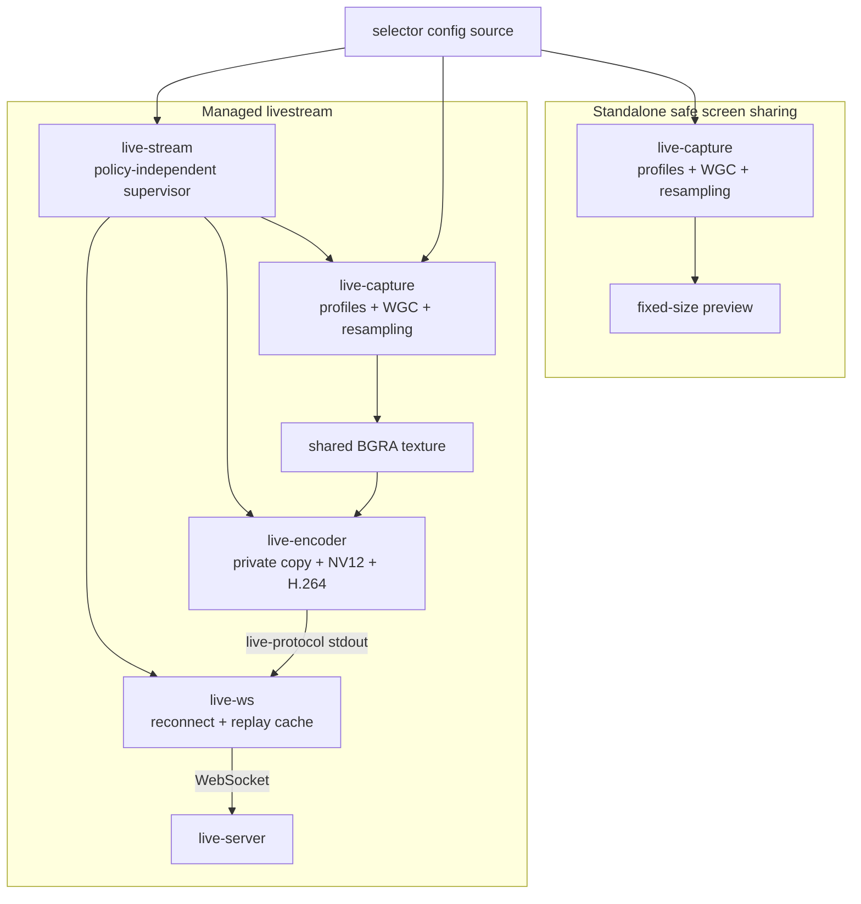

# Live Stream Pipeline Refactor

**Status:** In progress — Phase 5 complete

## Purpose

Split the current selector and encoded-video path into independently useful
programs with one supervisor responsible for composing the production stream.

The refactor grows from the experimental branch of `live-selector` from
`live-capture`. That branch isolated foreground-window matching, WGC, resampling,
and local presentation so safe selection could evolve without silently changing
encoded stream pixels. The target is not two permanent copies of the same
capture stack. Instead, the selector lineage becomes the canonical capture tool,
while the encoder lineage becomes a texture-to-video encoder.

The main user-facing outcome is that `live-capture` remains useful without any
livestream infrastructure. It can present a fixed-size, allowlisted view for safe
screen sharing using only a local configuration file. The full stream adds
`live-stream`, `live-encoder`, and `live-ws` around that same capture behavior.

The names describe the complete streaming path directly: `live-capture` acquires
safe pixels, `live-encoder` encodes them, `live-ws` transfers them, and
`live-stream` composes and supervises those responsibilities.

## Terminology

- **Stream mode:** A `live-stream` orchestration choice that determines which
  workers and configuration sources make up a stream. A mode is not understood
  by `live-capture` or `live-encoder`.
- **Profile:** A named set of window include and exclude rules interpreted by
  `live-capture`.
- **Enabled profiles:** The profiles whose rules currently form the safe capture
  policy. Multiple profiles may be enabled together.
- **Shared texture:** A fixed-size BGRA D3D11 texture created by `live-stream`,
  written by `live-capture`, and read by `live-encoder`.
- **Standalone capture:** `live-capture` with its local preview and no supervisor,
  encoder, relay, or server.
- **Managed capture:** `live-capture` launched by `live-stream` and publishing to
  the supervisor-provided shared texture.

## Design Principles

1. **Capture policy is independently useful.** Safe selection belongs to
   `live-capture`, so screen sharing does not require the encoding or networking
   pipeline.
2. **Workers do not know each other.** `live-capture` and `live-encoder` share a
   resource contract, not process-management code or crate dependencies.
3. **The supervisor owns composition.** Adapter selection, resource creation,
   local configuration ownership, child lifetimes, and pipe wiring belong to
   `live-stream`.
4. **Configuration fails closed.** Missing or initially invalid selector policy
   must never fall back to capturing an arbitrary foreground window.
5. **The per-frame path stays on the GPU.** Frames move through a shared texture
   and a private consumer copy without CPU readback.
6. **Slow consumers do not stall capture.** Shared-texture publication uses a
   non-blocking producer acquisition and may drop intermediate frames.
7. **Migration is reversible.** Existing commands remain available until the
   replacement path passes functional, failure, and performance verification.

## Target Architecture



The `source -> stream -> capture` path represents path ownership rather than
policy interpretation: `live-stream` carries one local file path and passes it
unchanged to capture. `live-capture` owns loading, reloading, parsing, and
matching semantics in both standalone and managed use. The remote server does
not own selector configuration.

## Component Contracts

### `live-capture`

Owns:

- loading, validating, and reloading selector profile TOML;
- foreground-window enumeration and profile matching;
- safe-target retention and HWND lifetime handling;
- WGC session creation and replacement;
- crop and fixed-size resampling behavior;
- standalone presentation;
- publishing resampled BGRA frames to a managed shared texture.

Does not own:

- stream modes or stream IDs;
- server HTTP configuration semantics;
- DXGI adapter policy in managed operation;
- BGRA-to-NV12 conversion or video encoding;
- `live-protocol` video framing;
- WebSocket transport or child supervision.

Its user-facing standalone inputs are a config path and output dimensions. In
managed operation, `live-stream` additionally supplies runtime-only GPU plumbing,
including the adapter identity and inherited shared-resource handle. Those
arguments are transport details rather than capture policy.

### `live-encoder`

Owns:

- opening and validating the supervisor-created shared texture;
- copying the published BGRA frame into a private texture;
- BGRA-to-NV12 conversion;
- NVENC H.264 configuration and encoding;
- AVCC conversion and `live-protocol` output to stdout.

Does not know about HWNDs, selector profiles, capture modes, HTTP, or
`live-capture`. Its input contract is only the shared resource, adapter identity,
texture format and dimensions, frame rate, and encoder settings.

### `live-stream`

Owns:

- interpreting stream modes and topologies;
- selecting one DXGI adapter for the managed GPU cohort;
- creating and retaining the fixed-size shared texture;
- passing the shared resource to both GPU workers;
- carrying the user-selected local selector file without interpreting it;
- launching and supervising `live-capture`, `live-encoder`, and `live-ws`;
- connecting `live-encoder` stdout directly to `live-ws` stdin;
- posting stream lifecycle metadata;
- applying restart policy and cleaning up all children on exit.

`live-stream` is allowed to be stateful because its state is explicitly process
and resource orchestration state. Media and selection behavior remain in their
workers.

### `live-ws`

Retains its current responsibility: read `live-protocol` messages from stdin,
maintain the transport connection, and replay cached video initialization data
after reconnecting.

## Selector Configuration

`data/selector-new.toml` is the ignored working example used to design the new
schema. Personal executable paths remain outside version control. The public
shape is:

```toml
[profiles]
enabled = ["code"]

[profiles.code]
include = [
    "Code.exe",
    "Zed.exe",
]

[profiles.game]
include = [
    "D:/Games/",
]
exclude = [
    "D:/Games/unsafe-overlay.exe",
]
```

### Matching semantics

1. Only entries named by `profiles.enabled` participate in matching.
2. Includes from every enabled profile form a union.
3. Excludes from every enabled profile form a global veto and take priority over
   every include, independent of profile or declaration order.
4. An empty enabled list selects no window.
5. An unknown enabled profile makes the candidate config invalid rather than
   silently weakening the allowlist.
6. Executable paths normalize slash direction. Windows path matching should be
   case-insensitive for both include and exclude rules so casing cannot bypass
   policy.
7. The active HWND is revalidated as foreground metadata changes. A previously
   accepted handle is not permanently trusted.
8. A disallowed foreground window never replaces the last valid selection.
   Before the first valid selection, the output remains at its clear color.

The first successfully parsed configuration becomes active atomically. A later
reload failure logs to stderr and retains the last valid configuration. This
keeps an already-safe session stable without ever accepting a partially parsed
or invalid update.

The initial schema intentionally keeps matching strings simple and compatible
with the existing substring-oriented selector behavior. Structured match rules
or exact-path operators may be added later if ambiguity becomes a practical
problem; they are not required for this refactor.

## Shared Texture Contract

`live-stream` creates a fixed-size `DXGI_FORMAT_B8G8R8A8_UNORM` D3D11 texture on
the selected adapter. The resource uses NT-handle sharing and a keyed mutex. The
supervisor passes access to both children without publishing a predictable global
resource name.

Both workers create their D3D11 devices on the adapter identified by the
supervisor. Adapter mismatch, texture-format mismatch, and dimension mismatch
are startup errors rather than implicit conversion paths.

The initial synchronization protocol is a two-key latest-frame mailbox:

1. `live-capture` attempts to acquire the producer key with a zero timeout.
2. On success, it publishes the newest complete resampled frame, submits its GPU
   work, and releases the consumer key.
3. When acquisition would block, `live-capture` skips that publication and
   continues capture and local presentation.
4. `live-encoder` acquires the consumer key, copies the shared texture into its own
   private BGRA texture, submits the copy, and immediately releases the producer
   key.
5. Conversion and encoding operate on the private copy outside the keyed mutex.

The private copy adds one GPU-local transfer per consumed frame but prevents
encoder latency from extending shared-resource ownership. At 1920×1200 BGRA and
60 frames per second, the copy traffic is about 553 MB/s; this is modest relative
to discrete-GPU memory bandwidth but must still be measured on the production
path.

An abandoned keyed mutex means the shared surface can no longer be trusted.
Either worker reports the condition and exits; `live-stream` recreates the
texture and restarts both GPU workers as one resource generation.

## Configuration Ownership

Standalone `live-capture` reads a user-selected local TOML file directly and
does not require HTTP.

For managed streaming, `live-stream` carries the user-selected local TOML path
and passes it unchanged to every capture-worker restart. `live-capture` retains
its existing bounded read, parse-before-activation, and last-valid reload
behavior. `live-stream` does not deserialize, copy, fetch, or rewrite profiles.

Keeping selector policy beside the streaming machine is simpler than storing it
on `live-server`, which may run remotely and does not have the same local window
or executable context. It also keeps configuration behavior identical between
standalone preview and managed streaming.

## Process Supervision

`live-stream` owns a Windows Job Object configured to terminate its children when
the supervisor handle closes. This prevents capture, encoder, or relay processes
from surviving an abnormal supervisor exit.

The initial restart boundaries are:

| Failure or change | Recovery |
|---|---|
| Selected HWND changes or closes | `live-capture` replaces only its WGC session; the process and shared texture remain valid where possible |
| `live-capture` exits | Restart `live-capture`; keep `live-encoder`, `live-ws`, and the shared texture alive |
| `live-encoder` exits | Recreate the stdout pipe and restart `live-encoder` plus `live-ws` |
| `live-ws` loses its connection | Existing reconnect and cache replay behavior |
| `live-ws` process exits | Recreate the stdout pipe and restart `live-encoder` plus `live-ws` |
| Keyed mutex is abandoned | Recreate the texture and restart both GPU workers |
| D3D device or adapter is removed | Re-select the adapter, recreate GPU resources, and restart both GPU workers |
| `live-stream` exits | Job Object terminates every managed child |

While capture is unavailable, the texture retains its last complete allowed
frame. Clearing or replacing stale output after a timeout is a presentation
policy that can be added after the base lifecycle is reliable.

## Rename and Lineage Strategy

The current names must change in an order that preserves useful `jj` history and
avoids two crates claiming the `live-capture` name:

1. Keep the current `live-selector` directory, crate, and binary names throughout
   development and integration.
2. Rename the current `live-capture` tree to `live-encoder` before substantially
   deleting or rewriting its implementation. This maximizes file similarity so
   `jj` can report the encoder as descended from the existing capture tree.
3. Simplify `live-encoder` behind the shared-texture input only after the rename
   is visible as a move. Do not create an empty encoder crate and copy selected
   files into it.
4. Build and verify shared-texture transport and `live-stream` against the still
   named `live-selector` producer.
5. Rename `live-selector` to `live-capture` only in the final cutover phase, after
   the old name is free and the managed pipeline is proven.

During implementation, the rename change should remain as mechanical as
practical and be inspected with `jj diff` before extraction changes obscure the
relationship. Temporary recipes may invoke the renamed encoder's legacy path so
the current end-to-end behavior remains available during migration.

## Migration Phases

### Phase 0 — Documentation and contracts (Complete)

- Record the target architecture in this plan and the main README.
- Treat `data/selector-new.toml` as ignored design input rather than a file to
  commit.
- Agree on ownership, config semantics, shared-resource invariants, and failure
  boundaries before moving code.

### Phase 1 — New profile model in `live-selector` (Complete)

- Implement TOML deserialization for enabled named profiles.
- Implement unioned includes and global exclusion vetoes.
- Normalize Windows path matching consistently.
- Add atomic reload behavior with last-valid retention.
- Add unit tests for empty, invalid, unknown, overlapping, excluded, and
  case-variant configurations.
- Keep the current fixed-size preview as the standalone validation surface.

### Phase 2 — Rename and extract `live-encoder` (Complete)

- Mechanically rename the current `live-capture` tree, package, and binary to
  `live-encoder` before major structural edits.
- Confirm that `jj` reports the existing files as moved rather than an unrelated
  deletion and addition.
- Temporarily retain the legacy capture CLI as needed for end-to-end comparison.
- Move NV12 conversion, NVENC, AVCC, and stdout framing behind a validated,
  fixed-size BGRA texture input boundary. Shared-handle opening, keyed-mutex
  acquisition, and the private consumer copy remain the Phase 3 proof.
- Preserve the current codec settings and stdout wire format.
- Verify that existing viewers and `live-ws --mode video` cannot distinguish the
  new encoder worker from the current producer.

The extracted input boundary has release-mode descriptor-validation coverage;
the protocol writer covers CodecParams and Frame ordering, SPS/PPS retention,
keyframe flags, timestamps, and AVCC payloads.
The transitional launchers now invoke `live-encoder`, while its legacy
`base|auto|crop` capture modes remain available for hardware comparison during
the shared-texture proof.

This rename frees the `live-capture` name while retaining the existing
`live-selector` name and a comparable legacy path during development.

### Phase 3 — Shared-texture proof (Complete)

- Create a minimal supervisor-owned shared texture on an explicitly selected
  adapter.
- Add managed-output support to the still named `live-selector`.
- Add shared-input support to `live-encoder`.
- Validate keyed-mutex recovery and inherited-handle lifetime.
- Record acquisition misses, copy time, conversion time, and encoded frame rate
  in release builds.

The implemented Phase 3 slice adds the internal `live-shared-texture` contract,
managed `live-selector` publication, `live-encoder --mode shared`, and the
temporary `live-texture-proof` owner. The owner selects one adapter, creates and
retains an unnamed NT handle, enables inheritance only across the two intended
GPU-worker spawns, and leaves encoder stdout attached directly
to the caller's pipe. It intentionally does not implement Phase 4 restart policy,
Job Object cleanup, local-config ownership, or stream metadata.

A bounded 1920×1200/60 release run on the RTX 5090 Laptop GPU completed with
75,050 bytes of unchanged `live-protocol` output, a 177.7 µs shared-to-private
copy submission, 57.0 BGRA-to-NV12 submissions per second, and 56.9 encoded
frames per second. That run exercised inherited-handle lifetime, initial clear
publication, consumer misses with private-frame reuse, direct stdout wiring, and
coupled normal shutdown with no remaining workers.

The Phase 4 hardware run closed the two remaining gates. An allowed Visual
Studio Code window sustained producer publication while the encoder continued
at 56.9 frames per second. A one-shot fault then terminated the selector while
it owned producer key 0: the encoder received raw `WAIT_ABANDONED`, exited with
the stable resource-loss code, and the supervisor replaced generation 1 with a
healthy generation 2.

### Phase 4 — Introduce `live-stream` (Complete)

- Implement adapter selection and shared-texture creation.
- Launch `live-selector` and `live-encoder` with one resource-generation
  contract.
- Carry the local selector file through every capture-worker restart.
- Connect `live-encoder` stdout to `live-ws` stdin without parsing media frames.
- Add Job Object cleanup and bounded restart backoff.
- Move stream-mode selection and computed stream metadata into the supervisor.

The implemented `live-stream --mode shared` owns the high-performance adapter,
mailbox, scoped handle inheritance, one-shot resource-generation contract,
selector/encoder/relay processes, and stream metadata. Selector stdout is an
unconditional JSONL debug and metadata surface in both standalone and managed
operation. Encoder stdout is attached directly to relay stdin as an anonymous OS
pipe; the supervisor never reads media bytes.

Each worker role has a bounded exponential restart budget. Ordinary selector
exit preserves the encoder, relay, and mailbox. Encoder or relay exit replaces
that pipe pair. Keyed-mutex abandonment or DXGI device loss uses stable exit code
20 to replace the entire GPU generation. A kill-on-close Windows Job Object
contains every descendant, including abnormal supervisor termination.

Release hardware verification on the RTX 5090 Laptop GPU exercised sustained
1920×1200/60 capture, an intentionally abandoned keyed mutex, generation 1 → 2
recovery, independent relay and encoder termination, direct pipeline recreation,
server unavailability, bounded supervisor exit, and forced supervisor
termination. Selector PID remained unchanged across both media-pipeline
restarts, the forced Job Object proof left none of its three exact child PIDs
alive, and no worker remained afterward.

### Phase 5 — Integrate special streams (Complete)

- Express the main automatic stream as one `live-stream` mode using a profile
  configuration source.
- Decide whether the YouTube Music wrapper becomes a `live-stream` mode or an
  independent capture-config provider.
- Keep low-level capture and encoding workers free of special-stream names.

The supervisor now exposes semantic `main` and `youtube-music` modes instead of
the Phase 4 implementation-detail `shared` mode. Main mode carries the local
profile source and retains the proven selector/shared-texture/encoder/relay
resource-generation behavior. The standard launcher is now
`just run capture main --config <path>`.

The YouTube Music wrapper became the second `live-stream` topology rather than a
capture-config provider. Its title-prefix discovery and DPI-aware player-bar crop
policy moved into the supervisor, which directly owns the generic crop encoder
and relay pair, window rediscovery, bounded restart backoff, and Job containment.
The dedicated wrapper crate was removed. `live-encoder` still sees only generic
`crop` arguments, and neither low-level GPU worker contains a special-stream
mode or name. Replacing that transitional direct-capture input with the canonical
shared-texture capture path remains part of final cutover.

### Phase 6 — Verify the transitional pipeline

- Exercise standalone safe sharing through `live-selector`.
- Exercise managed capture through
  `live-stream -> live-selector + live-encoder + live-ws`.
- Complete crash recovery, config reload, and release-build performance checks
  while the old and new lineages still have unambiguous names.
- Remove the encoder's legacy direct-capture path only after shared-texture input
  meets the compatibility and performance gates.

### Phase 7 — Final rename, cutover, and cleanup

- Rename `live-selector` to `live-capture` as the final component rename.
- Make the local TOML file and output dimensions the capture binary's primary
  public interface.
- Preserve optional fixed-size presentation for safe screen sharing.
- Remove selector HTTP fetching and encoded-stream responsibilities from the
  capture binary.
- Remove the transitional auto/shared launchers so `live-stream` modes are the
  only production orchestration path.
- Remove the legacy encoder `--mode auto|base|crop` interface after equivalent
  stream modes are available.
- Remove duplicated selector, WGC, D3D11, resampler, and shader implementations.
- Update the README architecture diagram, CLI reference, file tree, deployment
  examples, and lessons learned to describe the completed design.
- Archive this plan after its acceptance criteria are satisfied.

## Safety and Error Handling

- Invalid initial selector configuration produces only the clear frame.
- Invalid updates never partially replace the active policy.
- Unknown enabled profiles are reported with their exact names.
- Every accepted HWND is revalidated before it can become or remain the active
  target.
- Shared-handle inheritance is limited to intended children; unrelated handles
  must not leak into workers.
- Workers validate all resource descriptors supplied by the supervisor.
- Child exits and restart exhaustion are visible on stderr with component and
  resource-generation context.
- Restart loops use bounded exponential backoff to avoid hot failure loops.

## Performance Requirements

- Capture and local preview never block waiting for `live-encoder`.
- The managed path sustains 1920×1200 at 60 frames per second in release builds.
- Shared-texture misses are observable so silent starvation cannot masquerade as
  a functioning stream.
- The private BGRA copy and cross-process synchronization are benchmarked before
  removing the current direct encoder path.
- Selector parsing, config reload, foreground enumeration, and supervision remain
  off the per-frame encoding hot path.
- No CPU pixel readback is introduced.

## Verification Strategy

### Unit tests

- TOML parsing and validation;
- enabled-profile resolution;
- include union and exclusion precedence;
- slash and case normalization;
- safe behavior for missing or malformed configuration;
- pure supervisor restart-policy decisions;
- shared-resource descriptor validation.

### Integration checks

- Standalone safe preview with allowed and disallowed foreground windows.
- Managed producer and consumer on the same explicit adapter.
- Live config replacement while capture is running.
- Target window closure and recreation.
- Forced termination of each child independently.
- WebSocket disconnect and server restart.
- Keyed-mutex abandonment and complete resource-generation recovery.
- Supervisor termination with confirmation that no child remains alive.

### Compatibility checks

- `live-encoder | live-ws` emits the existing `live-protocol` stream.
- The server, frontend, codec initialization, and keyframe replay require no wire
  protocol changes.
- Special-stream orchestration continues to use fixed, well-known stream IDs.

## Dependencies

The profile migration added the `toml` crate as a direct workspace dependency.
It is necessary because the new user-authored format is TOML and the workspace
did not previously have a direct TOML parser. Hand-writing a parser would create
ambiguous edge cases in the component enforcing the screen-sharing safety policy.

`toml` is preferred because it integrates with the existing Serde data model and
implements the language rather than a project-specific subset. `toml_edit` would
be appropriate if the application needed to preserve comments and formatting
while editing files, but this design only needs deserialization. Keeping JSON
would avoid the dependency but would discard the explicitly chosen, more usable
configuration format. A manual parser is rejected on correctness and maintenance
grounds.

Parsing happens only on initial load and file changes, so this dependency does
not affect the capture or encoding hot paths. The implementation must bound the
accepted file size before parsing and report syntax or schema errors without
partially activating a configuration. Phases 4 and 5 added no third-party dependency:
it reuses the workspace's existing `win32job`, `ureq`, Serde/JSON, and Windows
bindings for containment, metadata posting, GPU-resource supervision, window
discovery, and DPI-aware crop geometry.

## Acceptance Criteria

The refactor is complete when:

1. `live-capture` can run standalone from a local profile TOML and never displays
   a window outside the enabled safety policy.
2. The same `live-capture` binary can publish into a supervisor-owned shared
   texture without encoding or networking dependencies.
3. `live-encoder` encodes that texture without knowing any capture or selector
   concepts.
4. `live-stream` owns adapter selection, resource lifetime, the local config
   path, child supervision, and relay pipe wiring.
5. Capture-target changes do not restart NVENC or `live-ws`.
6. Worker crashes and GPU-resource abandonment recover according to the documented
   restart boundaries.
7. The managed release pipeline meets the current 1920×1200/60 performance target
   without CPU pixel copies.
8. Current frontend and server behavior continues without a video wire-protocol
   migration.
