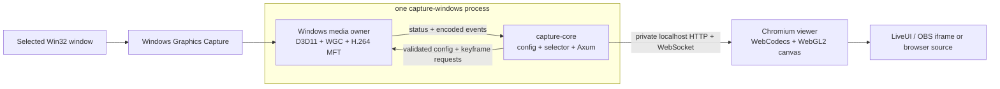

# TurboCapture M0 Guide

TurboCapture M0 is a small, machine-specific Windows capture pipeline. Each process owns one stream
from window observation through H.264 output. The browser owns decoding, color keying, and the final
transparent canvas.

This document is the operating and implementation reference for the finished M0 repository. The
constraints behind it live in [`M0-Principles.md`](M0-Principles.md); the completed migration work is
described by [`M0-Migration-Plan.md`](M0-Migration-Plan.md).

## Architecture



There is no central relay, shared cross-process texture, native presentation window, embedded webview,
or alpha-video transport. Run another `capture-windows` process on another explicit port when another
stream is needed.

The active source tree has four parts:

- `capture-core`: platform-independent configuration, pure selection policy, status/video types,
  bounded host channels, and the Axum instance service.
- `capture-windows`: Win32 observation, WGC, D3D11 processing, Media Foundation encoding, and the
  executable host.
- `frontend`: the strict localhost canvas route, reconnecting WebSocket client, WebCodecs decoder, and
  WebGL color-key renderer.
- `docs`: M0 design, migration history, and this operating guide.

A future control application may start/stop processes and use their REST APIs, but M0 does not reserve
or implement a placeholder crate for it.

## Supported environment

M0 intentionally assumes:

- Windows 11 on the current livestreaming machine.
- DXGI's first high-performance adapter and an NVIDIA hardware H.264 transform on that adapter.
- Windows Graphics Capture, D3D11 video processing, NV12 surfaces, and the Windows SDK `fxc.exe` on
  the Nushell login `PATH`.
- A current Rust toolchain and Cargo.
- Bun for the frontend; Nushell and `just` for the repository recipes.
- A Chromium-family browser with WebCodecs and WebGL2.
- A loopback capture endpoint as seen by the browser, either local or SSH-forwarded.

The `just shaders` recipe runs `compile_fixed_frame_shaders.bat`, which calls `fxc.exe` from the
Nushell login `PATH` and emits ignored shader bytecode into `crates/capture-windows/generated`.
Recipes that build or run `capture-windows` compile the shaders first.

## Instance configuration

The startup file is TOML. Unknown fields and invalid values are rejected before the service becomes
usable. This is a complete example:

```toml
[selection]
prefer_foreground = true
enabled = ["minecraft", "fallback-game"]

[selection.profiles.minecraft]
include = ["javaw.exe"]
exclude = ["launcher"]

[selection.profiles.fallback-game]
include = ["game.exe"]
exclude = []

[source.crop]
min_x = 0
min_y = 0
max_x = 1920
max_y = 1080

[video]
width = 1920
height = 1080
frame_rate = 60

[render.default]
key_colors = [[0, 255, 0]]
color_key_knee = { low = 0.02, high = 0.98 }

[render.profiles.minecraft]
key_colors = [[0, 255, 0], [1, 254, 1]]
color_key_knee = { low = 0.01, high = 0.20 }
binarization_color = [255, 255, 255]
```

`selection.enabled` lists active profiles in priority order. Definitions may remain in
`selection.profiles` while disabled. Include and exclude rules are case-insensitive executable-path
substrings; excludes from enabled profiles veto candidates globally. A still-valid current target
remains sticky, with the foreground preference used when choosing among otherwise eligible candidates.

`source.crop` is optional and uses inclusive minimum/exclusive maximum captured-texture coordinates.
The native pipeline clamps it to the live texture and aspect-fits it into the fixed opaque output,
clearing unused pixels. Video width and height must be non-zero, even, and representable as `u16`.
The H.264 CBR target defaults to `width * height * frame_rate / 4`, prioritizing keyed-edge accuracy
on the ordinary localhost path. Set optional `video.bit_rate` in bits per second only when a constrained
link or a measured encoder behavior requires an explicit override.

`render.default` is used while no profile override applies. Each `render.profiles` key must name a
defined selection profile, which may currently be disabled. Up to eight sRGB key colors are supported.
The knee must satisfy
`0 <= low < high <= 1`; `binarization_color` optionally replaces foreground RGB while retaining the
computed alpha.

## Running and viewing

Build everything once:

```console
just build
```

Start one process with an explicit configuration and port:

```console
$env.RUST_LOG = "info"
just capture --config data/minecraft.toml --port 48100
```

Only `--config` and `--port` are required. The process binds `127.0.0.1` and selects adapter index zero
from `IDXGIFactory6::EnumAdapterByGpuPreference` with `DXGI_GPU_PREFERENCE_HIGH_PERFORMANCE`. It rejects
software adapters and creates the D3D11 device on that explicit adapter.

Encoder discovery uses the adapter's LUID, NV12 input, H.264 output, and
`MFT_ENUM_FLAG_HARDWARE | MFT_ENUM_FLAG_SORTANDFILTER`. The first candidate whose friendly name contains
`nvidia` (ASCII case-insensitive) is selected in Media Foundation's returned preference order. The
encoder must support D3D11 input and receives the same device used by capture and conversion.

Adapter and encoder identities are logged, not configured through CLI or TOML. High-performance
preference does not guarantee NVIDIA: an unsupported preferred adapter, no matching NVIDIA encoder,
or failure to initialize the selected encoder is fatal. Lower-ranked GPUs and alternative encoders
are not tried. Driver changes may change the selections on the next process start.

Port and video settings require process restart to change; hardware selection is also fixed for the
process lifetime. Logging is configured exclusively through `RUST_LOG`.

Start the viewer on its own local port:

```console
just viewer 4173
```

The only accepted viewer route is:

```text
http://127.0.0.1:<viewer-port>/#/canvas?port=<capture-port>
```

For the commands above, use `http://127.0.0.1:4173/#/canvas?port=48100`. The frontend validates the
route and derives exactly `ws://127.0.0.1:48100/api/video`; the capture port is never sent to Vite or
interpreted by its server. An invalid route, absent target, disconnected endpoint, or decoder reset
leaves a transparent canvas.

Embed the same route directly:

```html
<iframe
  src="http://127.0.0.1:4173/#/canvas?port=48100"
  allow="autoplay"
></iframe>
```

The viewer reconnects with bounded exponential backoff. Each connection receives current render
parameters and begins decoding only from a fresh keyframe, so restart and target-switch recovery do
not display stale frames.

### Remote capture

The browser-facing model stays localhost-only. Forward a remote instance to the viewing machine:

```console
ssh -N -L 48100:127.0.0.1:48100 capture-host
```

Then use the ordinary `#/canvas?port=48100` viewer route. Choose distinct local ports for simultaneous
remote instances. Do not expose the private unauthenticated API to an untrusted network.

## Private instance API

Every capture process owns these routes on its fixed loopback address:

| Method | Route | Purpose |
| --- | --- | --- |
| `GET` | `/api/status` | Current generation, lifecycle state, target summary, rates, counters, and viewers |
| `GET` | `/api/config` | Active canonical configuration and its generation |
| `PUT` | `/api/config` | Validate and atomically replace one complete JSON configuration |
| `GET` | `/api/initialization` | Current render settings and optional WebCodecs decoder initialization |
| `GET` upgrade | `/api/video` | Render-control messages plus binary H.264 codec/access-unit events |

For example:

```console
curl.exe http://127.0.0.1:48100/api/status
curl.exe http://127.0.0.1:48100/api/config
```

`PUT /api/config` consumes the complete `config` object in JSON form, not a partial patch or the GET
response wrapper. It validates the candidate before publishing a new monotonic generation. Invalid
JSON or configuration returns a structured client error and preserves the last valid generation.
Changing `video` is rejected as restart-required in M0.

The video WebSocket is private to the in-repository frontend. Text messages carry render configuration;
binary messages carry checked codec generations and AVCC access units. Slow viewers are disconnected
instead of backpressuring the media owner, and compatibility with out-of-tree clients is not promised.

## Lifecycle and failures

The meaningful live states are `waiting`, `switching`, and `capturing`. No eligible target, target
closure, viewer disconnect, and live configuration rejection are recoverable. Status remains available
while the process waits for a matching window.

An unavailable or incompatible preferred adapter or NVIDIA encoder, unsupported graphics capability, bind
failure, unrecoverable D3D/WGC/Media Foundation failure, or internal invariant violation is fatal and
returns a non-zero process exit. M0 intentionally delegates process restart to the operator or a
future control surface.

Stopping the process stops the stream. Starting multiple processes on distinct ports creates multiple
independent streams; no discovery or shared lifecycle is involved.

## Development workflows

The maintained recipes are intentionally small:

| Recipe | Action |
| --- | --- |
| `just build` | Release-build the locked Rust workspace, including shaders |
| `just shaders` | Compile the fixed-frame shaders with FXC |
| `just capture [args]` | Run one release `capture-windows` instance |
| `just viewer [port]` | Run the localhost Vite viewer; the default is `4173` |
| `just test` | Run all release Rust tests with all features |
| `just clippy` | Run release Clippy over all targets/features and deny warnings |
| `just frontend-check` | Run Bun tests, TypeScript checks, Biome, and a production build |
| `just bun [args]` | Run an arbitrary Bun command in `frontend` |
| `just push`, `just pull` | Explicit jj/Git synchronization helpers |

Cargo commands are always run with `--release`; repository formatting is manual. Run `just shaders`
at least once after checkout and after changing the HLSL source, then useful direct checks are:

```console
cargo build --release --workspace --locked
cargo test --release --workspace --all-features --locked
cargo clippy --release --workspace --all-targets --all-features --locked -- -D warnings
cd frontend
bun install --frozen-lockfile
bun test
bun run check
bun run lint
bun run build
```

## M0 boundaries

M0 does not include distribution, portability, authentication, TLS, audio, keyboard metrics, LiveUI
widgets, native preview, an embedded browser, a generalized multi-stream daemon, transparent video,
automatic restart, or a stable external API. Those omissions preserve the core invariant: one small,
reviewable process owns one hardware capture/encode path, and one localhost browser canvas owns
presentation.
