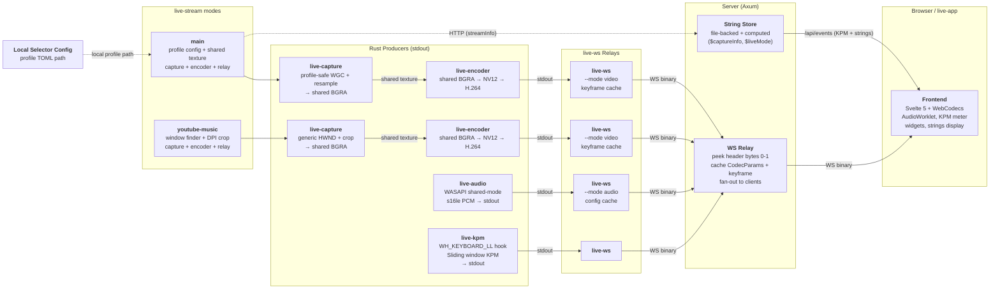

# Nekomaru LiveUI

**Nekomaru's livestreaming infrastructure.**

**Last Updated**: 2026-07-23

---

## Platform Baseline

Nekomaru LiveUI assumes the latest stable Windows 11 release, current GPU
drivers, and a modern DirectX runtime and hardware feature level. Supporting
older Windows releases, legacy drivers, or legacy GPU feature levels is not a
design constraint. Direct3D 11 interfaces remain intentional where they best
fit Windows Graphics Capture, shared textures, Media Foundation, and NVENC;
using those interfaces does not imply DirectX 11-era platform compatibility.

---

## Agent Rules

- **Always use `--release`** when invoking `cargo build` or `cargo run`. All binaries in this project are release-built by default.
- **Never hardcode `LIVE_PORT` or `LIVE_VITE_PORT`** values (e.g. `3000`, `5173`). When emitting Nushell scripts, use `$env.LIVE_PORT` and `$env.LIVE_VITE_PORT`.
- **Always write "YouTube Music" or "youtube-music"** (full words) — never abbreviate to "YTM" or "ytm" in code, comments, docs, or identifiers.

---

## Table of Contents

- **[Milestones](#milestones)**
- **[Architecture](#architecture)** — components, principles, file ownership
  - [Microservice Design](#microservice-design)
  - [Live Stream Separation](#live-stream-separation)
  - [Design Principles](#design-principles)
  - [Orchestration](#orchestration)
- **[Communication](#communication)** — wire protocol, HTTP/WS endpoints, CLI
  - [Wire Protocol (live-protocol)](#wire-protocol-live-protocol)
  - [HTTP & WebSocket API](#http--websocket-api)
- **[Internals](#internals)** — encoding pipeline, capture modes, deployment, reconnection
  - [Frontend Stage](#frontend-stage)
  - [Encoding Pipeline](#encoding-pipeline-reference)
  - [Capture Modes](#capture-modes)
  - [Distributed Deployment](#distributed-deployment)
  - [Reconnection Strategy](#reconnection-strategy)
  - [Color-Key Compositing](#color-key-compositing)
  - [Widgets](#widgets)
- [Performance Metrics](#performance-metrics)
- [File Structure](#file-structure)
- [Lessons Learned](#lessons-learned)
- [Known Issues](#known-issues)

---

## Milestones

This project is not semantically versioned. Instead, we track **milestones** (Mx) — architectural evolution points.

| Milestone | Architecture | Key Characteristics |
|-----------|-------------|---------------------|
| **M0** | Prototype | Auto-selector only — first proof of concept |
| **M1** | Monolith | Single Rust/wry process: capture + encoding + HTTP + webview |
| **M2** | Client-Server (TS) | TS server (Hono/Bun) + Rust capture children + Svelte frontend + Rust webview host |
| **M3** | Client-Server (Rust) | Full RIIR — Rust server (Axum) replaces TS server |
| **M4** | Microservice | Stdout-first Rust capture workers → `live-ws` relay → Rust server (Axum). **Current architecture.** |

**This document describes M4.** For the design journey from M3 to M4, see [`ARCHIVE-M4-DESIGN.md`](ARCHIVE-M4-DESIGN.md).

---

## Architecture

### Microservice Design

M4 splits the system into independently runnable components connected via stdout pipes and WebSocket.  Producers (`live-encoder`, `live-audio`, `live-kpm`) write binary frames to stdout using the `live-protocol` framing format.  `live-ws` reads stdin and relays each message as a WS binary message to the server.  The server is a thin Rust relay — no process management, no circular buffering.

Both video modes use the same managed shared-texture cohort. Capture and
encoding remain separate GPU processes; the supervisor owns their adapter,
mailbox generation, restart boundaries, and transport pipe.



### Component Summary

| Component | Language | Role | I/O |
|-----------|----------|------|-----|
| **`live-protocol`** | Rust (lib) | Shared 8-byte frame header + AVCC helpers + audio payloads | Used by all Rust crates |
| **`live-shared-texture`** | Rust (internal lib) | Explicit-adapter NT handle and keyed-mutex mailbox contract | inherited handle → shared BGRA texture |
| **`live-stream`** | Rust | Main and YouTube Music shared-texture modes, Job-contained process supervision, metadata, and restart policy | mode config + worker paths → managed video stream |
| **`live-encoder`** | Rust | Shared/private BGRA → NV12 → H.264 → stdout pipeline | shared BGRA texture → live-protocol framed stdout |
| **`live-audio`** | Rust | WASAPI audio capture → s16le PCM | stdout (live-protocol framed) |
| **`live-capture`** | Rust | Standalone profile-driven safe capture or supervisor-resolved generic crop, with optional local presentation | TOML/HWND + WGC → preview/shared BGRA + JSONL profile events |
| **`live-ws`** | Rust | stdin → WS relay (modes: default, video, audio) | stdin → WS binary messages |
| **`live-kpm`** | Rust | Keystroke counter | stdout (live-protocol framed) |
| **`enumerate-windows`** | Rust | Window discovery (JSON) | stdout JSON |
| **Server** | Rust (Axum) | WS relay, string store, config | WS ↔ WS, HTTP |
| **Frontend** | Svelte 5 + Vite | Viewer UI | WS (video, audio, events) |
| **`live-app`** | Rust (wry) | Optional webview host | — |

### Live Stream Separation

`live-capture` owns WGC, safe foreground selection, resampling, generic crop
publication, and optional local presentation. `live-encoder` owns only a
fixed-size shared BGRA input, its private GPU copy, NV12 conversion, H.264, and
protocol stdout. Neither worker launches or configures the other.

`live-stream` creates the shared texture and passes a narrowly inherited handle
to both workers. Main mode passes a local profile TOML unchanged to
`live-capture`; YouTube Music mode retains title discovery and DPI-aware crop
policy in the supervisor, then passes only generic HWND/crop coordinates to
`live-capture`. The encoder never knows about windows, profiles, or stream
modes, and capture never knows about encoding or networking.

Standalone mode needs only a local profile TOML and output dimensions. Its
fixed-size preview remains useful for safe screen sharing independently of the
livestream stack.

### Why This Design?

| Concern | Decision | Rationale |
|---------|----------|-----------|
| GPU capture + encoding | Rust (`live-capture` + `live-encoder`) | Requires `unsafe` Windows APIs, hardware access, and cross-process GPU texture sharing. |
| Network transport | `live-ws` (separate binary) | Producers have one code path (stdout). No WS client, no reconnect logic in capture code. `live-ws` handles all networking. |
| Audio capture | Rust (`live-audio`, standalone) | WASAPI shared-mode loopback, MMCSS priority, s16le PCM.  Stdout-first — piped through `live-ws --mode audio`. |
| Keystroke counting | Rust (`live-kpm`, standalone) | `WH_KEYBOARD_LL` hook on a dedicated message pump thread. Privacy-by-design. |
| HTTP/WS server | Rust (Axum) | Thin relay — uses `live-protocol` directly, no process management. Single toolchain. |
| Window discovery | Rust (`enumerate-windows`) | Lightweight binary for Nushell scripts. JSON output. |
| Standalone capture | Rust (`live-capture`) | Loads and atomically reloads a local profile allowlist, then owns selection, WGC, D3D11, resampling, and optional preview presentation. |
| YouTube Music capture | Rust (`live-stream --mode youtube-music`) | DPI-independent crop policy and window rediscovery compose generic capture, the shared encoder, and `live-ws`. |
| Orchestration | Nushell (`mod.nu`) | Launches pipelines, manages service lifecycle. |
| Frontend | Svelte 5 + WebCodecs | Pure viewer. Receives `live-protocol` framed messages via WS. Zero H.264 knowledge. |

### Why Rust for the Server?

The initial M4 design chose a TypeScript server (Bun/Hono) because the three M3 RIIR rationales no longer applied in a microservice architecture (see [`ARCHIVE-M4-DESIGN.md` § Why TypeScript Again](ARCHIVE-M4-DESIGN.md#why-typescript-again)).  During implementation, the balance tipped back to Rust.

**What changed:** the "opaque relay" assumption broke down.  The server's `/init` endpoint must parse CodecParams and build `avc1.*` codec strings + avcC descriptors — the same logic in `live-protocol/src/avcc.rs`.  In TypeScript this meant maintaining `codec.ts` as a hand-written mirror (~100 lines) that had to stay in sync.  In Rust, the server calls `live-protocol` directly — zero duplication.

| TS Benefit (from M4 design) | Reassessment |
|---|---|
| Faster iteration (HMR) | Full server restart preferred — HMR can leave stale state.  Compile time is not an issue since every `just` recipe runs `cargo build --release` anyway. |
| Native Vite integration | `vite_proxy.rs` from M3 already solves this — a Rust reverse proxy to the Vite dev server. |
| No binary parsing | Not true — `codec.ts` duplicated `live-protocol` for the `/init` endpoint. |
| WS ergonomics | Overstated — Axum's `WebSocketUpgrade` extractor + `tokio::sync::broadcast` handles the relay fan-out pattern cleanly. |
| Portfolio (full-stack TS) | Frontend is still Svelte/TypeScript/Bun, so the project remains hybrid. |

**The decisive gain:** single toolchain.  `cargo build --release` builds every binary in the project.  No Bun, no `node_modules`, no second package manager for the server.

### Well-Known Stream IDs

The system uses **fixed, well-known stream IDs** rather than dynamically generated ones.  Each pipeline is assigned its ID at launch (via `--stream-id` on `live-ws`), and the frontend hardcodes the same IDs.

| Stream ID | Producer | Purpose |
|-----------|----------|---------|
| `"main"` | `live-stream --mode main` | Profile-allowlisted foreground window |
| `"youtube-music"` | `live-stream --mode youtube-music` | YouTube Music playback bar |

**Why fixed IDs?**  The frontend is a pure viewer — it has zero stream management logic.  It renders `"main"` unconditionally and shows `"youtube-music"` when available (polled via `GET /api/streams`).  No discovery protocol, no negotiation, no dynamic allocation.  When the auto-selector hot-swaps the captured window, the stream ID stays `"main"` — the server sends fresh CodecParams and a keyframe, and the frontend reinitializes its decoder.

**Where IDs are assigned:**  Nushell orchestration (`mod.nu`) passes `--stream-id` to `live-ws`, which connects to `/internal/streams/:id`.  The server creates the stream slot on first encoder connection.

### Design Principles

These principles guide M4 development and operation.

1. **No Internal Start/Stop State.**  If a process is running, it's active.  Kill it to stop it.  No state machines, no `Starting → Running → Stopped` transitions.

2. **Explicit Local Configuration.** Each component gets its configuration from
   CLI arguments. `live-capture` atomically reloads its local profile TOML; no
   media worker polls the server for policy or accepts stdin commands.

3. **Stdout-First Producers.**  `live-encoder`, `live-audio`, and `live-kpm` write to stdout via `live-protocol` framing.  Zero networking dependencies.  `> dump.bin` IS the production code path.

4. **Independently Runnable.**  Every component can run standalone.  No component assumes it was spawned by another.  Server runs with or without any workers connected.

5. **Pipes + WS Everywhere.**  Producers → stdout → `live-ws` → WS → server → WS → frontend.  Distributed deployment is a consequence, not a feature — just change the server URL.

6. **Server is a Relay, Not a Manager.**  The server doesn't spawn processes or manage lifecycles.  It receives connections and relays data.

7. **Errors Go to stderr.**  Each process logs to stderr via `pretty_env_logger`.  No error protocol between components.

8. **Fixed Resolutions.**  Each stream has a fixed output resolution.  The encoder never needs reconfiguration on window switch — the staging texture, NV12 converter, and MFT media types all stay the same.

9. **Fixed Design Composition.** The frontend is authored in a 1280×720
   logical coordinate system. `Stage` uniformly fits that composition
   into the host browser surface, so WebView2 and OBS can provide different
   raster sizes without changing layout geometry.

### File Ownership

Each source file has a primary owner — **agent** (Claude) or **human** (Nekomaru). See [`FILE-OWNERSHIP.md`](../FILE-OWNERSHIP.md) for the full per-file breakdown.

### Orchestration

The system is launched via **`just`** recipes (`.justfile`) backed by **Nushell** commands (`mod.nu`).  `just` is the user-facing entry point; `mod.nu` contains the implementation.

#### Just Recipes

| Recipe | Description |
|--------|-------------|
| `just list` | List all available recipes |
| `just compile-shaders` | Compile the entries in `shaders.toml` to SM5.0 `.fxo` bytecode with `fxc` |
| `just run <name> [args]` | Run a `mod.nu` launcher such as `server`, `capture`, `stream main`, `audio`, `kpm`, or `app` |
| `just bun <args>` | Run Bun in `frontend/` |
| `just tsc [args]` | Type-check the frontend with `bunx --bun tsc --noEmit` |
| `just svc [args]` | Check Svelte components with `bunx --bun svelte-check` |
| `just cargo <command> [args]` | Compile shaders, then run the requested Cargo command with `--release` |
| `just push [bookmark] [revision]` | Move a jj bookmark and push to GitHub |
| `just pull [bookmark]` | Fetch from GitHub and create a new working copy |
| `just get <path> [args]` | Make an HTTP GET request |
| `just put <path> <data> [args]` | Make an HTTP PUT request |
| `just post <path> <data> [args]` | Make an HTTP POST request |
| `just refresh` | Ask the server to reload its configuration |
| `just get-string` | Fetch the complete string store |
| `just set-string <key> <value>` | Set one string-store entry |

#### `mod.nu` Exported Commands

| Command | Description |
|---------|-------------|
| `compile-shaders` | Compile stale repository-root `shaders.toml` entries with `fxc`, emitting `<source-stem>_<entry>.fxo` beside each HLSL source |
| `get-exe <name> [--copy <id>]` | Build a binary and return its path. `--copy` creates a named copy for concurrent use. |
| `get-url [path] [--ws]` | Build an HTTP or WS URL from `LIVE_HOST`/`LIVE_PORT` |
| `check-env <var>` | Error if an environment variable is not set |
| `patch-env <var> <default>` | Prompt to set an environment variable if missing |
| `run-server` | Launch `live-server` (builds first via `get-exe`) |
| `run-app [--resizable]` | Launch `live-app` webview (builds + copies via `get-exe`); opt into resizing for layout testing |
| `run-youtube-music` | Launch YouTube Music webview (builds + copies via `get-exe`) |
| `run-capture [--config path]` | Launch standalone `live-capture`; defaults to ignored `data/live-capture.toml` |
| `run-stream main [--config path]` | Launch `live-stream --mode main` with a local TOML, shared-texture cohort, and direct encoder-to-relay pipe |
| `run-stream youtube-music` | Launch `live-stream --mode youtube-music` with title discovery, DPI crop policy, shared-texture cohort, and direct encoder-to-relay pipe |
| `run-audio [device]` | Launch the audio pipeline (`live-audio \| live-ws --mode audio`) |
| `run-kpm` | Launch the KPM pipeline (`live-kpm \| live-ws`) |
| `run-ccusage [--loop]` | Run `ccusage` once (default) or every 60s (`--loop`) and post today's Claude Code token + cost totals to the string store |

#### Build Freshness & Copy Rule

Each `[[compile]]` shader entry may declare `dependencies = ["common.hlsli", ...]` as exact paths relative to its HLSL source directory. The field may be omitted when the shader has no includes. `compile-shaders` invokes `fxc` only when the output is missing or older than the main HLSL source or any declared dependency; missing dependencies are reported as manifest errors.

Every binary invocation goes through `get-exe`, which runs `cargo build --release --bin <name>` to ensure the binary is up-to-date.  Binaries that may run concurrently across launchers (`live-stream`, `live-capture`, `live-encoder`, `live-ws`, `live-app`) use `get-exe --copy <id>` to copy the exe before spawning — this prevents file locking from blocking subsequent builds on Windows.

---

## Communication

### Wire Protocol (live-protocol)

All binary IPC uses the `live-protocol` 8-byte aligned frame header.  Used on stdout (producer → live-ws), on WebSocket (live-ws → server → frontend), and in dump files.

#### Frame Header (8 bytes)

```
Offset  Field            Size    Notes
0       message_type     u8      0x01=CodecParams, 0x02=Frame, 0x10=KpmUpdate, 0x11=AudioConfig, 0x12=AudioChunk, 0xFF=Error
1       flags            u8      bit 0: IS_KEYFRAME (video), bits 1-7: reserved
2       reserved         u16     zero
4       payload_length   u32 LE
[payload_length bytes follow]
```

#### Message Types

##### `0x01` — CodecParams

Sent once after encoder initialization, and again if SPS/PPS change (e.g. on hot-swap).

```
[u16 LE: width][u16 LE: height]
[u16 LE: sps_length][sps bytes]
[u16 LE: pps_length][pps bytes]
```

##### `0x02` — Frame

Sent for every encoded frame. `is_keyframe` is in the header `flags` field, not in the payload.

```
[u64 LE: timestamp_us][avcc bytes]
```

The AVCC payload is pre-built by `live-encoder` — concatenated length-prefixed NAL units (4-byte BE length + raw NAL data, no Annex B start codes). Directly feedable to `EncodedVideoChunk`.

##### `0x10` — KpmUpdate

Sent by `live-kpm` on value change.

```
[i64 LE: kpm_value]
```

##### `0x11` — AudioConfig

Sent once by `live-audio` after WASAPI device initialization.

```
[u32 LE: sample_rate][u8: channels][u8: bits_per_sample][u16: reserved=0]
```

##### `0x12` — AudioChunk

Sent by `live-audio` every 10ms (480 samples at 48kHz).

```
[u64 LE: timestamp_us][interleaved s16le PCM bytes]
```

##### `0xFF` — Error

Non-fatal error. Fatal errors are signaled by process exit.

```
[UTF-8 error message bytes]
```

### live-audio CLI

```bash
# List available audio capture devices
live-audio --list-devices

# Capture from a named device to stdout
live-audio --device "Loopback L + R (Focusrite USB Audio)"

# Full pipeline — capture + relay to server
live-audio --device "..." | live-ws --mode audio --server ws://host:3000/internal/audio

# Dump to file (same binary format as production)
live-audio --device "..." > dump.bin
```

### live-encoder CLI

`live-encoder` has one input contract: a fixed-size supervisor-owned shared BGRA
texture on an explicit adapter. It copies each complete publication into a
private texture, releases the producer key, converts to NV12, encodes H.264, and
writes `live-protocol` messages to stdout. It has no HWND, crop, selector,
presentation, HTTP, or WebSocket interface.

```bash
# Supervisor plumbing; normally emitted only by live-stream
live-encoder --width 1920 --height 1200 --fps 60 \
  --adapter-luid 0x... --shared-handle 0x... > dump.bin
```

### live-stream CLI

`live-stream` owns two production topologies. Both select the
high-performance DXGI adapter, create one shared-texture generation, restrict
handle inheritance to the two GPU workers, connect encoder stdout directly to
relay stdin, and contain every descendant in a kill-on-close Windows Job
Object. Main mode carries a local profile TOML to `live-capture`; YouTube Music
mode discovers the titled window, computes its DPI-aware player-bar crop, and
passes only generic HWND/crop geometry to the same capture binary.

In main mode, ordinary capture exit restarts only capture; encoder or relay exit
recreates that pipe pair; keyed-mutex abandonment or DXGI device loss replaces
the complete GPU generation. YouTube Music recreates its crop cohort and
rediscovers window geometry when any worker exits. Every restart class uses
capped exponential backoff with a finite consecutive-attempt budget.

The selector TOML always remains local to the streaming machine. `live-stream`
passes its path unchanged and never fetches, copies, or parses policy. The server
may run remotely without becoming a configuration authority.

```bash
# Repository launcher
just run stream main --config data/live-capture.toml

# Direct main invocation; worker executables are normally resolved by mod.nu
live-stream --mode main \
  --capture live-capture.exe --encoder live-encoder.exe --relay live-ws.exe \
  --config data/live-capture.toml \
  --server ws://host/internal/streams/main \
  --info-url http://host/internal/streams/main/info

# Direct YouTube Music invocation; defaults to stream ID youtube-music and 15 fps
live-stream --mode youtube-music \
  --capture live-capture.exe --encoder live-encoder.exe --relay live-ws.exe \
  --youtube-music-title "YouTube Music - Nekomaru LiveUI" \
  --server ws://host/internal/streams/youtube-music
```

### live-capture CLI

`live-capture` loads enabled named profiles from a local TOML file, matches
foreground executable paths against their unioned includes and global exclusion
vetoes, and resamples the selected window directly into a fixed-size local D3D11
window. Invalid initial configuration fails closed; invalid reloads retain the
last fully validated policy. It performs no NV12 conversion, H.264 encoding,
stdout media framing, or network transport. When `live-stream` supplies an
adapter LUID and inherited handle, it publishes BGRA frames with a zero-timeout
producer acquisition; a busy encoder drops only that publication and never
stalls capture or local presentation.

Every invocation emits line-delimited JSON selection transitions on stdout.
This is a standalone debugging surface and the managed metadata contract; it is
not media framing. Redirect it to the platform null device when it is unwanted.
Overlapping enabled profiles use the first matching name in TOML order as their
deterministic metadata label, while exclusions still veto the complete union.

```json
{"event":"selected","hwnd":"0x1234","title":"Editor","file_description":"Visual Studio Code","profile":"code"}
{"event":"cleared"}
```

```bash
# Normally launched through the repository environment helper
just run capture

# Direct standalone invocation
live-capture --config data/live-capture.toml \
  --width 1920 --height 1200 --title "Live Capture"

# Preview without retaining JSONL diagnostics
live-capture --config data/live-capture.toml > /dev/null

# Managed profile output is headless in production
live-capture --config data/live-capture.toml --width 1920 --height 1200 \
  --headless --adapter-luid 0x... --shared-handle 0x...
```

The preview excludes its own HWND from selector matching. Focusing the preview
therefore keeps the last valid selected window instead of recursively capturing
itself.

The supervisor-only crop source uses `--hwnd` with a complete
`--crop-min-x/y --crop-max-x/y` rectangle, exact padded output dimensions,
`--headless`, and the inherited mailbox contract. Special-stream discovery
and crop policy remain outside `live-capture`.

`live-capture` intentionally does not depend on `live-encoder`; their only
compatibility boundary is the validated shared-texture descriptor and keyed
mutex protocol.

### enumerate-windows CLI

```bash
# List all capturable windows as JSON
enumerate-windows

# Get the current foreground window as JSON
enumerate-windows --foreground
```

---

### HTTP & WebSocket API

Served by the Rust server (Axum). Port configured via `LIVE_PORT` (required).

Endpoints are split into two namespaces:
- **`/api/`** — public, frontend-facing
- **`/internal/`** — worker-facing (encoder input, capture events)

#### Public API (`/api`)

##### Streams

**`GET /api/streams`** — List active streams (derived from connected encoder WS sockets).

```json
[{ "id": "main" }, { "id": "youtube-music" }]
```

**`GET /api/streams/:id/init`** — Pre-built decoder configuration. The server parses cached CodecParams via `live-protocol` to build the `avc1.PPCCLL` codec string and avcC descriptor.

```json
{
    "codec": "avc1.42001f",
    "width": 1920,
    "height": 1200,
    "description": "<base64 of avcC descriptor>"
}
```

**`WS /api/streams/:id`** — Frontend viewer. Pushes relayed binary messages. On connect, sends cached CodecParams + last keyframe for immediate playback.

##### Audio

**`WS /api/audio`** — Frontend audio stream. Pushes binary `live-protocol` messages (`AudioConfig` + `AudioChunk`). On connect, sends cached `AudioConfig` for immediate AudioWorklet setup.

##### Events (unified frontend telemetry)

**`WS /api/events`** — Single push channel for lightweight viewer telemetry. Replaces the per-source `/api/kpm` and `/api/strings/ws` endpoints (both still registered during migration, but no longer used by the frontend).

Tagged JSON text frames — currently two `type` values:

```jsonc
{ "type": "kpm",     "kpm": 142 }                              // null when encoder is offline
{ "type": "strings", "data": { "$captureInfo": "...", ... } }  // full merged snapshot
```

On connect: replays the current KPM value, then the full strings snapshot (in that order, atomically).  Subsequent updates fire a single tagged message per change.  Implemented via `tokio::select!` over the KPM and strings `watch::Receiver`s so both sources share one fan-in loop.

Why one endpoint: the frontend used to open four reconnect-loops in parallel (video, audio, kpm, strings) with duplicated backoff logic; KPM and strings are the small JSON-text streams where the connection-count cost dominated.  Heavy media (video, audio) stays on dedicated endpoints — they have their own keyframe / config caches, lifecycles, and backpressure policies, and folding them in would invite head-of-line blocking.

##### KPM (legacy)

**`WS /api/kpm`** — Frontend KPM display. Pushes `{"kpm": N}` or `{"kpm": null}` JSON text. Initial value sent on connect.  *Superseded by `/api/events`; kept registered while the migration settles, slated for removal in a follow-up commit.*

##### String Store

Server-managed key-value store. Keys prefixed with `$` are **computed strings** — readonly values set by worker info reports.

**Current computed strings:**

| Key | Source | Description |
|-----|--------|-------------|
| `$captureInfo` | `POST /internal/streams/:id/info` | Human-readable label for the captured window |
| `$captureMode` | `POST /internal/streams/:id/info` | Current topology (e.g. `"auto"`, `"main"`) |
| `$liveMode` | `POST /internal/streams/:id/info` | Matched legacy tag or first matching enabled TOML profile (e.g. `"code"`, `"game"`) |
| `$microphone` | Audio encoder connect/disconnect | Audio stream status (present when `live-audio` encoder is connected, absent otherwise) |
| `$timestamp` | Server startup | Revision timestamp via `jj log` |
| `$claudeTokens` | `run-ccusage` poller | Today's total Claude Code token count (raw integer; frontend formats to millions) |
| `$claudeCost` | `run-ccusage` poller | Today's estimated Claude Code cost in USD (raw float) |

**`GET /api/strings`** — All key-value pairs (file-backed + computed).  Kept for ad-hoc inspection (curl, Nushell scripts); the frontend now consumes string snapshots via `/api/events`.

**`GET /api/strings/:key`** — Single string value.

**`WS /api/strings/ws`** — Snapshot stream.  Sends the merged `get_all()` JSON object on connect and again after every mutation.  Multiple writes between polls coalesce via a `tokio::sync::watch` channel — viewers only ever see the latest state.  *Superseded by `/api/events` (which embeds the same snapshots under `{"type":"strings",...}`); kept registered during migration, slated for removal in a follow-up commit.*

**`PUT /api/strings/:key`** — Set a string value (plain text body). Returns 403 for `$`-prefixed keys.

**`DELETE /api/strings/:key`** — Delete a string. Returns 403 for `$`-prefixed keys.

##### Refresh

**`POST /api/refresh`** — Reload the string store from disk.

#### Internal API (`/internal`)

##### Encoder Input

**`WS /internal/streams/:id`** — Encoder input. Receives `live-protocol` binary messages from `live-ws`. The server peeks at header bytes 0-1 to cache CodecParams and keyframes, then fan-outs to all connected frontend clients.

**`WS /internal/audio`** — Audio input from `live-audio` via `live-ws --mode audio`. Binary `live-protocol` messages (`AudioConfig` + `AudioChunk`). The server caches `AudioConfig` for late-joining viewers, then broadcasts all messages.

**`WS /internal/kpm`** — KPM input from `live-kpm` via `live-ws`. Binary `live-protocol` messages.

##### Computed Strings

**`PUT /internal/strings/:key`** — Set a computed string (`$`-prefixed) from an external process (plain text body).  Returns 400 if the key doesn't start with `$`.

**`DELETE /internal/strings/:key`** — Remove a computed string (`$`-prefixed).  Returns 400 if the key doesn't start with `$`.  Used by `run-microphone` to signal absence (e.g. Cubase not running).

##### Stream Info

**`POST /internal/streams/:streamId/info`** — Selection-transition metadata
posted asynchronously by `live-stream` after parsing `live-capture` JSONL.
Updates computed strings without putting HTTP on the capture hot path.

```json
{
    "hwnd": "0x1A2B",
    "title": "Visual Studio Code",
    "file_description": "Visual Studio Code",
    "mode": "code"
}
```

---

## Internals

### Frontend Stage

The frontend separates its **logical design size** from the browser's **host
raster size**. `Stage` owns a fixed 1280×720 design surface and applies
one uniform contain scale:

```
scale = min(host width / 1280, host height / 720)
```

Matching aspect ratios fill the host exactly. Other ratios center the complete
composition with the dark `#app` background as letterboxing; the stage itself
owns `background.png`, so its crop remains part of the fixed design. Layout
never depends on `devicePixelRatio`: WebView2 may reach a high-density raster
through `live-app --scale-factor`, while an OBS Browser Source can expose a
larger CSS viewport and receive the equivalent scale from `Stage`.

For a full-screen 1080p OBS scene, configure the Browser Source as 1920×1080 at
60 FPS and leave its scene transform at 1:1. The frontend scales its logical
stage by 1.5. `live-app` remains fixed-size by default; pass `--resizable` while
testing contain scaling and letterboxing interactively.

### Encoding Pipeline Reference

#### Format Converter (`live-encoder/src/converter.rs`)

GPU-accelerated BGRA→NV12 conversion via `ID3D11VideoProcessor`. Hardware H.264 encoders require NV12 input. Performance: ~0.5-1ms for 1920x1200.

#### H.264 Encoder (`live-encoder/src/encoder.rs`)

Async Media Foundation Transform (MFT). Runs a blocking event loop:

- `METransformNeedInput` → read from staging texture, convert, feed to encoder
- `METransformHaveOutput` → parse NAL units, convert to AVCC, write to stdout

NAL unit types: SPS(7) ~27B, PPS(8) ~8B, IDR(5) ~67KB, NonIDR(1) ~1.5-30KB.

#### "Bakery Model" (Capture Thread ↔ Encoding Thread)

The shared BGRA texture is the shelf. `live-capture` acquires producer key 0
with a zero timeout, submits one complete resample or crop, flushes, and releases
consumer key 1. `live-encoder` holds key 1 only while it submits
`CopyResource` into its private BGRA texture, then returns key 0 before
BGRA-to-NV12 conversion or NVENC work. Capture never waits for encoder latency,
and no CPU pixel copy is introduced.

### Capture Sources

The primary `live-capture` source is a local profile TOML. The supervisor-only
source is a generic HWND plus absolute crop rectangle. Both publish into the
same fixed mailbox contract; `live-encoder` has no source modes.

```toml
[profiles]
enabled = ["code"]

[profiles.code]
include = ["Code.exe", "Zed.exe"]

[profiles.game]
include = ["D:/Games/"]
exclude = ["D:/Games/unsafe-overlay.exe"]
```

Includes from enabled profiles form a union. Excludes from every enabled
profile are a global veto, slash direction and case are normalized for Windows,
an empty enabled list selects nothing, and an unknown enabled profile invalidates
the update. A rejected reload retains the last fully validated policy.

### Distributed Deployment

M4's microservice design enables splitting components across machines.  Each producer is a stdout-first executable piped through `live-ws` — just point `live-ws` at a remote server URL.

```
Machine A (streaming):  server + live-stream --mode youtube-music + YouTube Music + OBS + live-app
Machine B (working):    live-stream --mode main + live-kpm
```

- YouTube Music audio: OBS captures system audio directly on Machine A.  Zero network audio transfer.
- Only the main video stream crosses the LAN (~1.8 MB/s at 60fps, trivial on gigabit).
- Machine B runs only what needs direct window/GPU access.
- Face capture (OBS camera) stays on Machine A — no CPU competition with `rustc`.

### Reconnection Strategy

`live-ws` owns all reconnection logic — producers don't know about WS state.

- The encoder writes to stdout continuously.  If `live-ws` disconnects, it discards incoming messages.
- On reconnect, `live-ws --mode video` replays the cached last CodecParams + last keyframe so the server immediately has valid codec state and a clean entry point.  `--mode audio` similarly replays the cached `AudioConfig`.
- Exponential backoff (100ms → 5s) prevents reconnection storms.
- The encoder never restarts — avoiding the NVENC teardown that M4 was designed to eliminate.

#### Frontend reconnect helper

The viewer side mirrors the same backoff curve through a single helper, `runReconnectingWS(path, signal, body)` in [`frontend/src/ws.ts`](../frontend/src/ws.ts).  It owns URL construction, abort wiring, and the 100ms→5s exponential reset-on-open loop; per-stream bodies own message parsing and decide when the connection ends (typically by resolving on `onclose`).  All three viewer-side WSes (`/api/streams/:id`, `/api/audio`, `/api/events`) flow through it — no duplicated backoff loops across streams.

### Codec & Keyframe Caching

H.264 decoders need two things before they can produce frames: **CodecParams** (SPS/PPS — the encoder's configuration) to initialize, and a **keyframe** (IDR) as a decode entry point.  Without caching, anything that missed these must wait up to 2 seconds (one full GOP of 120 frames at 60fps) for the next naturally-occurring IDR.

Two independent caches at different points in the pipeline eliminate this wait:

**`live-ws` cache — reconnect replay.**  The encoder never restarts (core M4 principle — avoiding NVENC teardown).  When the WS connection drops, `live-ws` reconnects and replays the cached CodecParams + keyframe *before* resuming normal forwarding.  The server instantly has valid codec state and a clean decode entry point.  This cache lives outside the server process, so it also survives server restarts — `live-ws` reconnects and replays, warming the server immediately.

**Server cache — late-joiner init.**  The server fans out to multiple frontend clients.  A browser tab can open at any time — mid-stream, after a refresh, on a second monitor.  On viewer connect, the server sends cached CodecParams + keyframe for immediate playback.  The same CodecParams cache also powers the `GET /api/v1/streams/:id/init` endpoint, which parses the SPS/PPS to build the `avc1.PPCCLL` codec string and avcC descriptor for `VideoDecoder.configure()`.

| Scenario | `live-ws` cache | Server cache |
|----------|:---:|:---:|
| WS drops, `live-ws` reconnects | Replays to server | — |
| Server restarts | Replays to server | Rebuilt from replay |
| New browser tab connects | — | Sends to viewer |
| Hot-swap (new SPS/PPS) | Updates cache | Updates cache |

Neither cache is redundant.  Removing the `live-ws` cache means the server loses codec state on reconnect.  Removing the server cache means every new viewer waits for the next keyframe.

### Color-Key Compositing

The frontend uses a WebGL2 fragment shader (`frontend/src/video/color-key.ts`) to replace one or more target colors with transparency in incoming video frames.  Used by the YouTube Music island (`#212121` background) and the main stream (the dark UI greys), so the page backdrop bleeds through wherever the captured app shows its own background.

**Algorithm (per pixel, in linear-light space):**

1. Convert the source pixel sRGB → linear.
2. For each key, compute a per-channel "foreground signal vs. background" ratio (`(src − key) / (1 − key)`, clamped at zero) and take the max-channel.  The lowest result across keys is the alpha estimate; the same loop tracks which key matched best (for unspill).
3. Shape with `smoothstep(kneeLow, kneeHigh, alpha)` — defaults `[0.02, 0.98]`.  `kneeLow` is the noise floor (compression jitter near the background snaps to 0); `kneeHigh` snaps near-solid foreground to 1; the middle preserves anti-aliased edges.
4. Unspill against the best-matching key (`src − key · (1 − alpha)`), divide out alpha to recover straight RGB, re-encode linear → sRGB.

Working in linear space is what kills dark fringing — without it, the gamma curve makes near-key pixels look halo'd against dark UI backgrounds.

The `<StreamRenderer>` component accepts `colorKey?: string | string[]` (up to 8 hex colors) and `colorKeyKnee?: [number, number]`.  Both fall back to defaults when omitted; omitting `colorKey` entirely bypasses the shader and uses a plain 2D canvas blit.

#### Strings-Gated Keys (Main Stream)

For the main stream, `App.svelte` chooses the active key set from the
`$captureInfo` / `$liveMode` strings, so keys track the captured profile.
`live-capture` emits a complete JSONL transition before dispatching the matching
capture swap. `live-stream` drains that low-frequency stdout on a dedicated
thread and queues the HTTP update to a bounded-time metadata worker. Capture
policy and the per-frame path never wait for the server; ordering remains
best-effort by the latency margin between a small metadata POST and the first
new-window frame traversing capture, NVENC, and WebSocket.

### Widgets

The left column of the UI hosts **widgets** — small status indicators built from a shared `LiveWidget` component (`frontend/src/widgets/LiveWidget.svelte`).

#### Layout

Each widget has a consistent three-part structure:

```
┌─────────────────────┐
│  [icon]  Label      │   ← icon (optional) + muted label (text-xs, 60% opacity)
│          Content    │   ← prominent value (text-base, full opacity)
└─────────────────────┘
```

#### Dynamic Content

`LiveWidget` is purely presentational. For dynamic values, the parent component reads from the `strings` rune singleton (`frontend/src/events.svelte.ts`) — a WS-backed snapshot of the server's string store, fed by `/api/events` — and passes values as `children`.  The same module also exposes the `kpm` rune consumed by `KpmMeter.svelte`.

#### Placement

Widgets are rendered inside the left-column island in `App.svelte` using `flex-col gap-3` layout.

---

## Performance Metrics

### Latency Breakdown (Estimated)

| Component | Time | Method |
|-----------|------|--------|
| Capture | 0-16ms | Windows Graphics Capture (1 frame buffer) |
| Resample | 0.5-1ms | GPU shader (fullscreen triangle) |
| GPU Flush + Wait | 5ms | `Flush()` + `sleep(5ms)` |
| BGRA→NV12 | 0.5-1ms | `ID3D11VideoProcessor` |
| GPU Flush | 1-2ms | `Flush()` |
| H.264 Encode | 5-15ms | NVENC hardware encoder |
| AVCC Serialize | <0.1ms | CPU: strip start codes + length prefix |
| IPC (stdout → live-ws) | <0.1ms | Pipe buffer, same machine |
| WS relay (server) | <1ms | Localhost or LAN |
| **Total** | **13-36ms** | Well under 100ms target |

### Frame Sizes (1920x1200 @ 8 Mbps CBR)

| Frame Type | Size Range | Scenario |
|------------|------------|----------|
| **IDR (keyframe)** | ~67 KB | SPS(27B) + PPS(8B) + full I-frame |
| **P-frame (static)** | 1.5-10 KB | Mostly unchanged screen content |
| **P-frame (typing/scrolling)** | 10-30 KB | Text editing, web browsing |
| **P-frame (high motion)** | 30-50 KB | Video playback, animations |

### Encoding Settings

| Setting | Value | Reason |
|---------|-------|--------|
| Profile | H.264 Baseline | No B-frames, WebCodecs compatibility |
| Bitrate | 8 Mbps CBR | Constant for predictable latency |
| Frame Rate | 60 fps | Encoder runs at constant 60fps |
| GOP Size | 120 frames (2 sec) | Fast recovery from packet loss |
| B-frames | 0 | Baseline profile prohibits (low latency) |
| Low Latency Mode | Enabled | `CODECAPI_AVLowLatencyMode = true` |

---

## File Structure

```
LiveUI/
├── Cargo.toml                       # Workspace root
├── .justfile                        # Task runner recipes (just)
├── mod.nu                           # Nushell orchestration module
├── shaders.toml                      # fxc shader compilation manifest
│
├── docs/
│   ├── README.md                    # This document
│   ├── README-Audio.md              # Audio capture and playback notes
│   ├── PLAN-UI-AudioMeter.md        # Audio meter UI plan
│   ├── ARCHIVE-M0-Prototype.md      # Initial prototype history
│   ├── ARCHIVE-M4-DESIGN.md         # M4 architecture design & journey
│   ├── ARCHIVE-M4-KPMMeter.md       # Completed KPM meter plan
│   └── ARCHIVE-M4-StreamSupervisor.md # Completed capture/video/supervisor refactor
│
├── data/                            # Persisted runtime data (gitignored)
│   ├── strings.json                 # String store key-value pairs
│   └── strings/                     # Per-key Markdown files for multiline values
│
├── live-protocol/                   # Shared binary framing protocol (Rust lib)
│   └── src/
│       ├── lib.rs                   # 8-byte frame header, MessageType, Flags, read/write
│       ├── audio.rs                 # AudioConfig + AudioChunk payload serialization
│       ├── avcc.rs                  # Annex B → AVCC conversion, codec string, avcC builder
│       └── video.rs                 # CodecParams + Frame payload serialization
│
├── crates/live-shared-texture/      # Shared D3D11 mailbox contract
│   └── src/
│       └── lib.rs                   # Adapter, scoped NT handle, descriptor, mutex + loss contract
│
├── live-stream/                     # Multi-topology video supervisor (Rust)
│   └── src/
│       ├── main.rs                  # Job containment, resource generations, child/pipe ownership
│       ├── metadata.rs              # Capture JSONL reader + bounded-time HTTP poster
│       ├── restart.rs               # Pure restart boundaries + bounded exponential policy
│       └── youtube_music.rs         # Window discovery, DPI crop policy, shared cohort
│
├── live-encoder/                    # Shared-texture H.264 encoder (Rust)
│   └── src/
│       ├── lib.rs                   # NALUnit/NALUnitType types, module re-exports
│       ├── main.rs                  # Fixed shared-texture input CLI
│       ├── converter.rs             # GPU BGRA→NV12 via ID3D11VideoProcessor
│       ├── d3d11.rs                 # Encoder-private texture allocation
│       ├── encoder.rs               # NVENC H.264 async MFT
│       ├── encoder/                 # NVENC helpers (debug, helper)
│       └── pipeline.rs              # Shared BGRA → private copy → NV12/NVENC/AVCC/stdout
│
├── live-audio/                      # WASAPI audio capture → stdout (Rust)
│   └── src/main.rs                  # CLI (--device, --list-devices), WASAPI capture, PCM chunking
│
├── live-ws/                         # stdin → WebSocket relay (Rust)
│   └── src/main.rs                  # CLI, stdin reader, WS client, --mode video|audio caching
│
├── live-capture/                    # Safe standalone/managed GPU capture (Rust)
│   └── src/
│       ├── main.rs                  # CLI, selector integration, winit lifecycle
│       ├── presenter.rs             # D3D11 swap chain + direct GPU presentation
│       ├── publisher.rs             # Non-blocking resample/crop publication + metrics
│       ├── capture.rs               # WGC session + viewport/crop geometry
│       ├── d3d11.rs                 # Capture-owned D3D11 device and view helpers
│       ├── resample.rs + .hlsl      # Capture-owned fullscreen resampler and shader
│       └── selector/                # TOML policy reload, matching + JSONL selection events
│
├── live-kpm/                        # Standalone keystroke counter (Rust)
│   └── src/
│       ├── main.rs                  # Entry point, timer loop, stdout output
│       ├── hook.rs                  # WH_KEYBOARD_LL hook, atomic counter, auto-repeat suppression
│       ├── calculator.rs            # Sliding window KPM calculator (5s window)
│       └── message_pump.rs          # Reusable Win32 message pump (dedicated OS thread)
│
├── live-server/                     # M4 relay server (Rust, Axum)
│   └── src/
│       ├── main.rs                  # Entry point, Axum router, Vite spawn, jj timestamp
│       ├── state.rs                 # Shared AppState (strings, video, audio, kpm)
│       ├── video.rs                 # Video WS relay, codec caching, /init, /streams
│       ├── audio.rs                 # Audio WS relay (broadcast + cached AudioConfig)
│       ├── kpm.rs                   # KPM input WS + legacy /api/kpm viewer (superseded by events_ws)
│       ├── strings.rs               # String store (file-backed + computed) + legacy /api/strings/ws (superseded by events_ws)
│       ├── events.rs                # Backward-compatible stream lifecycle/selection metadata
│       ├── events_ws.rs             # Unified /api/events WS — multiplexes KPM + strings
│       ├── util.rs                  # Shared poisoned-lock recovery helper
│       └── vite_proxy.rs            # Reverse proxy to Vite dev server
│
├── live-app/                        # Optional webview host (wry)
│   └── src/main.rs
│
├── crates/
│   ├── enumerate-windows/           # Window enumeration (lib + bin, JSON output)
│   └── set-dpi-awareness/           # Per-monitor DPI awareness v2
│
├── frontend/                        # Frontend (Svelte 5 + Vite + Tailwind)
│   ├── package.json
│   ├── svelte.config.ts
│   ├── vite.config.ts
│   ├── vite.d.ts
│   ├── index.html
│   ├── index.ts                     # Entry point (Svelte 5 mount)
│   └── src/
│       ├── App.svelte               # Pure viewer shell (JetBrains Islands dark theme)
│       ├── KpmMeter.svelte          # Vertical VU-style KPM meter (peak hold + decay)
│       ├── api.ts                   # fetch() wrapper for /api/streams
│       ├── ws.ts                    # `runReconnectingWS` helper + `wsMessages` async iterator
│       ├── events.svelte.ts         # `strings` + `kpm` runes — singleton WS to /api/events
│       ├── streams.svelte.ts        # `streamStatus` rune (polls /api/streams every 2s)
│       ├── audio/
│       │   ├── AudioStream.svelte   # <AudioStream> (WS push, live-protocol parser, AudioContext)
│       │   ├── worklet.ts           # AudioWorklet PCM ring buffer processor
│       │   └── worklet-env.d.ts     # Ambient types for AudioWorklet context
│       ├── components/              # Stage + reusable Svelte primitives
│       ├── widgets/                 # LiveWidget + Clock, LiveMode, ClaudeUsage, and About widgets
│       └── video/
│           ├── StreamRenderer.svelte  # <StreamRenderer> (canvas + color-key)
│           ├── stream-loop.ts         # WS reader → live-protocol parser → decoder
│           ├── decoder.ts             # H264Decoder (thin WebCodecs wrapper)
│           └── color-key.ts           # WebGL2 color-key renderer
```

---

## Lessons Learned

### Bug #1: Codec API Settings Order

**Problem**: `ICodecAPI::SetValue()` before media types → "parameter is incorrect"

**Fix**: Set media types first, then codec API values. Correct order:
1. Output media type (H.264, resolution, frame rate, bitrate, profile)
2. Input media type (NV12, resolution, frame rate)
3. D3D manager (attach GPU device)
4. Codec API values (B-frames, GOP, latency mode, rate control)
5. Start streaming

### Bug #2: Missing Viewport → Empty Frames

**Problem**: All P-frames were 12 bytes (black frames). Resampler didn't set viewport → GPU clipped fullscreen triangle → empty output.

**Fix**: Always set `RSSetViewports()` before draw calls.

### Bug #3: `get-url` Prompt Blocks Pipeline Setup

**Problem**: In a Nushell pipeline like `(^producer args | ^consumer --server (get-url --ws ...))`, the `get-url` call may trigger `patch-env`'s interactive prompt (to set `LIVE_HOST`).  While the prompt waits for user input, the producer has already started and is writing to stdout.  But the consumer hasn't started yet (its argument is still being evaluated), so there's no reader on the pipe.  The producer hits a broken pipe and exits before the pipeline is fully assembled.

**Fix**: Ensure `get-url` / `patch-env` is called *before* the pipeline expression — either in a `let` binding or a preceding statement — so the interactive prompt resolves before any process is spawned.

### Bug #4: Sync HTTP POST Stalled the Selector Polling Loop

**Problem**: the legacy auto encoder ran its stream-info POST synchronously in
the foreground polling thread. When the server slowed or went away, pattern
matching and capture swaps paused.

**Fix**: The final split removes HTTP from `live-capture` entirely. It emits
JSONL transitions before capture swaps; `live-stream` owns a dedicated
bounded-time metadata poster. Strict ordering is intentionally best-effort by
latency margin.

**Lesson**: When a polling loop calls a blocking syscall (HTTP, IO, etc.) on every tick, the loop's worst-case period is the syscall's worst-case latency.  If a timing invariant is only enforced by happening to block, that invariant is often actually a latency-margin one and can be made explicit.

### Bug #5: New DXGI Interface Did Not Mean a New Factory Generation

**Problem**: the first Phase 3 mailbox used
`CreateDXGIFactory::<IDXGIFactory6>()`. The returned COM object exposed the v6
interface and adapter enumeration worked, but D3D11 still classified devices
created from those adapters as DXGI-1.0-derived. Every texture carrying
`D3D11_RESOURCE_MISC_SHARED_KEYEDMUTEX` therefore failed with `E_INVALIDARG`.

**Fix**: create the factory with `CreateDXGIFactory1::<IDXGIFactory6>()`. The
API used to create the object—not merely the newest interface queried from
it—establishes the factory generation required by keyed-mutex resources.

The same hardware proof also disabled winit drag/drop for `live-capture`:
winit otherwise calls STA-oriented `OleInitialize`, which conflicts with the
MTA already selected for Windows Graphics Capture. The preview has no file-drop
behavior, so disabling that unused integration is the narrow fix.

### Bug #6: Worker Exit Did Not Identify the Safe Restart Boundary

**Problem**: a capture or encoder process exit alone cannot say whether only
that worker failed or the shared keyed-mutex surface became invalid. Restarting
one worker after mutex abandonment repeatedly reopened an untrustworthy resource;
restarting every process for ordinary errors discarded healthy GPU and network
state.

**Fix**: keyed-mutex abandonment and DXGI device-loss errors now become a typed
resource-generation failure inside the worker and stable process exit code 20 at
the supervisor boundary. `live-stream` maps ordinary capture, encoder/relay,
and resource-loss exits to three separately tested restart scopes. A scoped
inheritance guard permits each restarted GPU worker to receive the mailbox while
ensuring the relay cannot inherit it.

The hardware fault hook exited `live-capture` while producer key 0 was owned.
`live-encoder` observed raw `WAIT_ABANDONED`, exited with code 20, and
`live-stream` replaced generation 1 with a healthy generation 2. Independent
relay and encoder termination replaced only their pipe pair and preserved the
capture PID. Force-terminating the supervisor closed its Job Object and removed
all three exact managed child PIDs.

---

## Known Issues

### 1. Hardcoded NVIDIA Encoder

Only selects encoders with "nvidia" in name. Fails on Intel/AMD.
**Priority**: Low (personal use, RTX 5090).

---

## References

### Windows API
- [Media Foundation Transforms](https://learn.microsoft.com/en-us/windows/win32/medfound/media-foundation-transforms)
- [H.264 Video Encoder](https://learn.microsoft.com/en-us/windows/win32/medfound/h-264-video-encoder)
- [ID3D11VideoProcessor](https://learn.microsoft.com/en-us/windows/win32/api/d3d11/nn-d3d11-id3d11videoprocessor)
- [Async MFTs](https://learn.microsoft.com/en-us/windows/win32/medfound/asynchronous-mfts)

### Web Standards
- [WebCodecs API](https://w3c.github.io/webcodecs/)
- [H.264 Specification](https://www.itu.int/rec/T-REC-H.264)
- [ISO 14496-15 (AVC File Format)](https://www.iso.org/standard/55980.html)

---

**Author**: Nekomaru
**Co-Pilot**: Claude
**Hardware**: NVIDIA GeForce RTX 5090
**License**: Personal Use Only
